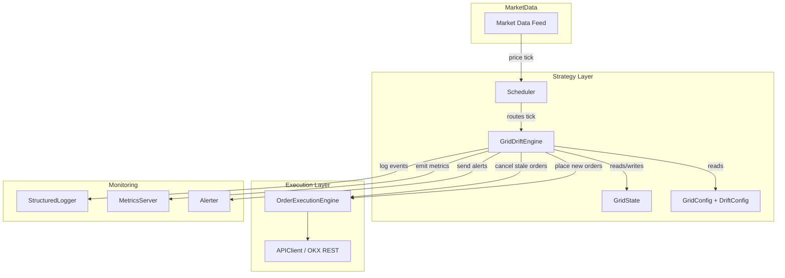
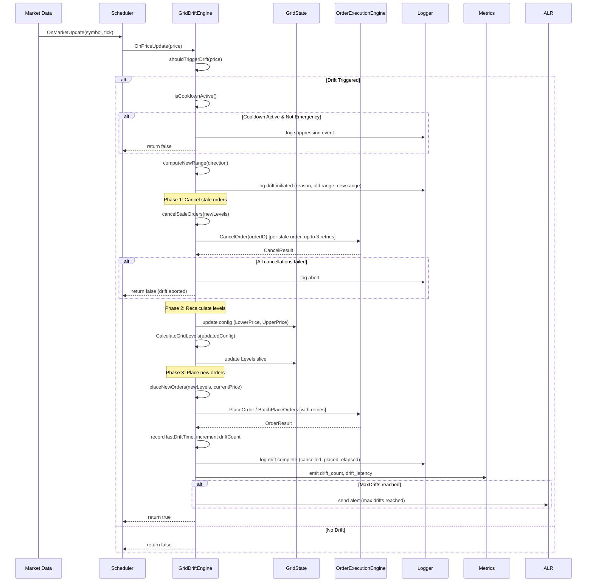

# Design Document: Grid Drift

## Overview

Grid Drift adds automatic grid range relocation to the existing grid trading strategy. When the market price approaches or crosses a grid boundary, the system shifts the entire grid range in the direction of price movement — cancelling stale orders and placing new ones — to maintain continuous trading without manual intervention.

The feature is implemented as a new `GridDriftEngine` component that:
1. Monitors price updates to detect boundary proximity (drift triggers)
2. Computes new grid range boundaries using configurable step sizes
3. Orchestrates the order lifecycle: cancel stale → recalculate levels → place new orders
4. Preserves existing position and PnL state during the transition
5. Enforces cooldown periods and drift limits to prevent excessive churn

The engine integrates with the existing `Scheduler`, `GridState`, and `OrderExecutionEngine` infrastructure, keeping drift logic encapsulated while reusing shared order placement and cancellation paths.

## Architecture

### Component Diagram



### Key Design Decisions

1. **Separate engine, not inline in Scheduler**: `GridDriftEngine` is a dedicated struct rather than additional logic in the Scheduler's `processGridUpdate`. This keeps drift concerns isolated, testable, and optional (controlled by `DriftConfig.Enabled`).

2. **Synchronous execution within tick handler**: Drift evaluation and execution happen synchronously within a single price tick to guarantee atomic state transitions. The lock on `GridState` prevents concurrent fill handling during a drift.

3. **Reuse `CalculateGridLevels`**: After computing new boundaries, the engine calls the existing `CalculateGridLevels` function to produce the new level set, preserving arithmetic/geometric consistency.

4. **Cancel-first ordering**: The engine always cancels stale orders before placing new ones to avoid exceeding exchange position/order-count limits.

5. **Partial success is acceptable for placement**: If some new orders fail after retries, the engine continues operating with whatever orders were successfully placed (requirement 8.3), rather than rolling back the entire drift.

## Components and Interfaces

### GridDriftEngine

```go
// GridDriftEngine manages automatic grid range relocation.
type GridDriftEngine struct {
    config        *models.GridConfig
    driftConfig   *models.DriftConfig
    state         *GridState
    execEngine    execution.OrderExecutionEngine
    logger        *monitor.StructuredLogger
    metrics       *monitor.MetricsServer
    alerter       *monitor.Alerter

    // Runtime drift state
    lastDriftTime time.Time
    driftCount    int
    gridSpacing   decimal.Decimal // cached spacing = (upper - lower) / gridCount
    mu            sync.Mutex
}
```

#### Public Methods

```go
// NewGridDriftEngine creates a new drift engine from config and dependencies.
func NewGridDriftEngine(
    config *models.GridConfig,
    state *GridState,
    execEngine execution.OrderExecutionEngine,
    logger *monitor.StructuredLogger,
    metrics *monitor.MetricsServer,
    alerter *monitor.Alerter,
) *GridDriftEngine

// OnPriceUpdate evaluates drift conditions on each price tick.
// Returns true if a drift was executed, false otherwise.
func (e *GridDriftEngine) OnPriceUpdate(currentPrice decimal.Decimal) bool

// Reset resets the drift engine state (e.g., on strategy restart).
func (e *GridDriftEngine) Reset()

// DriftCount returns the number of drifts executed in the current session.
func (e *GridDriftEngine) DriftCount() int
```

#### Internal Methods

```go
// shouldTriggerDrift evaluates whether a drift is needed given the current price.
// Returns the drift direction (Up, Down, None) and whether it's an emergency override.
func (e *GridDriftEngine) shouldTriggerDrift(price decimal.Decimal) (DriftDirection, bool)

// isCooldownActive returns true if the cooldown period has not elapsed.
func (e *GridDriftEngine) isCooldownActive() bool

// isEmergencyOverride returns true if the price has exceeded 2x DriftStep beyond boundary.
func (e *GridDriftEngine) isEmergencyOverride(price decimal.Decimal, direction DriftDirection) bool

// computeNewRange calculates the new UpperPrice and LowerPrice given the drift direction.
func (e *GridDriftEngine) computeNewRange(direction DriftDirection) (newLower, newUpper decimal.Decimal)

// executeDrift performs the full drift sequence: cancel → recalculate → place.
func (e *GridDriftEngine) executeDrift(direction DriftDirection, currentPrice decimal.Decimal, emergency bool) error

// cancelStaleOrders cancels orders at levels no longer in the new range.
// Returns the number cancelled and any error.
func (e *GridDriftEngine) cancelStaleOrders(newLevels []decimal.Decimal) (int, error)

// placeNewOrders places orders at newly created levels.
// Returns the number placed and any error.
func (e *GridDriftEngine) placeNewOrders(newLevels []decimal.Decimal, currentPrice decimal.Decimal) (int, error)
```

### DriftDirection Type

```go
type DriftDirection int

const (
    DriftNone DriftDirection = iota
    DriftUp
    DriftDown
)
```

### Integration with Scheduler

The `Scheduler.processGridUpdate` method will be extended to call `GridDriftEngine.OnPriceUpdate` before evaluating standard grid signals:

```go
func (s *Scheduler) processGridUpdate(instance *StrategyInstance, tick *models.TickData) models.SignalDirection {
    if instance.DriftEngine != nil {
        instance.DriftEngine.OnPriceUpdate(tick.LastPrice)
    }
    // ... existing grid signal logic
}
```

`StrategyInstance` gains a new field:

```go
type StrategyInstance struct {
    // ... existing fields
    DriftEngine *GridDriftEngine // nil if drift disabled
}
```

### Sequence Diagram: Drift Execution Flow



## Data Models

### DriftConfig (new, added to `pkg/models/grid.go`)

```go
// DriftConfig holds configuration for automatic grid range relocation.
type DriftConfig struct {
    Enabled        bool            `json:"enabled" yaml:"enabled"`                  // Enable/disable drift
    DriftThreshold decimal.Decimal `json:"driftThreshold" yaml:"drift_threshold"`   // Boundary zone as fraction of range [0.01, 0.50]
    DriftStep      int             `json:"driftStep" yaml:"drift_step"`             // Grid intervals to shift per drift (positive integer)
    CooldownPeriod time.Duration   `json:"cooldownPeriod" yaml:"cooldown_period"`   // Minimum time between drifts (min 5s, default 30s)
    MaxDrifts      int             `json:"maxDrifts" yaml:"max_drifts"`             // Max drifts per session (0 = unlimited)
}
```

### GridConfig Extension

```go
// GridConfig gains a new optional field:
type GridConfig struct {
    // ... existing fields ...
    Drift *DriftConfig `json:"drift,omitempty" yaml:"drift,omitempty"` // Drift configuration (nil = disabled)
}
```

### DriftEvent (for logging/audit)

```go
// DriftEvent records a single drift operation for audit and replay.
type DriftEvent struct {
    Timestamp      time.Time       `json:"timestamp"`
    Direction      DriftDirection  `json:"direction"`       // Up or Down
    TriggerReason  string          `json:"triggerReason"`   // "boundary_zone" or "price_exceeded" or "emergency"
    TriggerPrice   decimal.Decimal `json:"triggerPrice"`
    OldLower       decimal.Decimal `json:"oldLower"`
    OldUpper       decimal.Decimal `json:"oldUpper"`
    NewLower       decimal.Decimal `json:"newLower"`
    NewUpper       decimal.Decimal `json:"newUpper"`
    OrdersCancelled int            `json:"ordersCancelled"`
    OrdersPlaced   int             `json:"ordersPlaced"`
    OrdersFailed   int             `json:"ordersFailed"`
    ElapsedMs      int64           `json:"elapsedMs"`
    Success        bool            `json:"success"`
    AbortReason    string          `json:"abortReason,omitempty"`
}
```

### GridState Changes

No new fields are added to `GridState`. The existing `Levels`, `Position`, `AvgEntryPrice`, `RealizedPnL`, `TotalBuys`, and `TotalSells` fields are preserved across drifts. The `Levels` slice is replaced with new levels after a successful drift (requirement 8.5 — only after cancellations complete).

### Prometheus Metrics (new)

| Metric Name | Type | Description |
|---|---|---|
| `grid_drift_total` | Counter | Total number of drift operations executed |
| `grid_drift_latency_ms` | Histogram | Drift execution time in milliseconds |
| `grid_drift_failure_total` | Counter | Total number of failed/aborted drifts |
| `grid_drift_suppressed_total` | Counter | Drifts suppressed by cooldown |

## Correctness Properties

*A property is a characteristic or behavior that should hold true across all valid executions of a system — essentially, a formal statement about what the system should do. Properties serve as the bridge between human-readable specifications and machine-verifiable correctness guarantees.*

### Property 1: Boundary Zone Detection Symmetry

*For any* valid grid configuration (LowerPrice < UpperPrice, DriftThreshold in [0.01, 0.50]) and *for any* price, the drift trigger evaluates to `DriftUp` if and only if the price is within the upper boundary zone, and `DriftDown` if and only if the price is within the lower boundary zone.

**Validates: Requirements 1.1, 1.2, 1.3, 1.4**

### Property 2: Range Shift Preserves Grid Width

*For any* grid configuration and *for any* drift direction (Up or Down), the new range width (NewUpper - NewLower) SHALL equal the old range width (OldUpper - OldLower). That is, drift translates the range without stretching or compressing it.

**Validates: Requirements 2.1, 2.2, 2.3, 2.4**

### Property 3: New Levels Are Valid Grid Levels

*For any* drift operation, the recalculated levels after drift SHALL satisfy all grid level invariants: exactly GridCount+1 levels, strictly ascending, first level equals new LowerPrice, last level equals new UpperPrice.

**Validates: Requirements 2.5**

### Property 4: Position Preservation

*For any* GridState with arbitrary Position, AvgEntryPrice, RealizedPnL, TotalBuys, and TotalSells values, after executing a drift, all four values SHALL remain unchanged.

**Validates: Requirements 4.1, 4.2, 4.3, 4.4**

### Property 5: Cooldown Enforcement

*For any* sequence of consecutive price ticks that trigger drift conditions, if the time elapsed since the last drift is less than CooldownPeriod, the drift SHALL be suppressed — unless the emergency override condition is met.

**Validates: Requirements 5.1, 5.2, 5.3**

### Property 6: Emergency Override Threshold

*For any* price that exceeds the grid boundary by more than 2× DriftStep × grid spacing during active cooldown, the drift SHALL execute regardless of cooldown.

**Validates: Requirements 5.4**

### Property 7: New LowerPrice Positivity

*For any* downward drift, the computed new LowerPrice SHALL always be positive. If the naive computation produces zero or negative, it SHALL be clamped to the minimum tick size.

**Validates: Requirements 2.6, 2.7**

### Property 8: Order Placement Direction Correctness

*For any* set of new grid levels and a current market price, all BUY orders SHALL be placed at levels below the current price and all SELL orders SHALL be placed at levels above the current price.

**Validates: Requirements 3.4**

### Property 9: DriftConfig Validation Bounds

*For any* DriftConfig, DriftThreshold must be in [0.01, 0.50], DriftStep must be a positive integer, CooldownPeriod must be ≥ 5 seconds, and MaxDrifts must be non-negative.

**Validates: Requirements 6.1, 6.2, 6.3, 6.4, 6.5**

### Property 10: Abort Preserves Previous State

*For any* drift that is aborted (e.g., all cancellations fail), the GridState levels, config LowerPrice, and config UpperPrice SHALL remain at their pre-drift values.

**Validates: Requirements 8.2, 8.4**

## Error Handling

### Error Categories

| Category | Example | Recovery Strategy |
|---|---|---|
| Order Cancellation Failure | OKX returns error for cancel | Retry up to 3× with 1s interval. If all fail for ALL orders → abort drift. If partial → proceed. |
| Order Placement Failure | OKX rejects new order | Retry up to 3× with 1s interval. If partial fail → log alert, continue with placed orders. |
| Invalid Configuration | DriftThreshold out of range | Reject at config validation time. Engine refuses to start. |
| Negative LowerPrice | Downward drift produces ≤ 0 | Clamp to minimum tick size, adjust range. |
| MaxDrifts Exceeded | Session drift limit reached | Stop triggering drifts, emit CRITICAL alert via Alerter. |
| Rate Limit (HTTP 429) | Too many API calls | Handled by existing `APIClient` retry with exponential backoff. |
| Concurrent Access | Fill arrives during drift | `sync.Mutex` on `GridDriftEngine` serializes drift execution with fill handling. |

### Error Flow

1. **Pre-drift validation**: Verify cooldown, MaxDrifts, config validity. Fail fast with log.
2. **Cancel phase**: Cancel stale orders one by one (or batch). Track successes/failures. If zero succeed after retries → abort.
3. **Recalculate phase**: Pure computation, no external calls. Errors here are programming bugs.
4. **Place phase**: Place new orders. Track successes/failures. On partial failure → emit WARNING alert, continue.
5. **Post-drift**: Record timestamp, emit metrics. Any error here is non-critical (monitoring only).

### Concurrency Safety

- `GridDriftEngine.mu` (sync.Mutex) protects `lastDriftTime`, `driftCount`, and ensures only one drift executes at a time.
- The caller (Scheduler) holds `StrategyInstance` access via its own `sync.RWMutex`, preventing concurrent `OnMarketUpdate` and `OnOrderFill` from racing with drift execution.

## Testing Strategy

### Property-Based Testing

This feature is well-suited for property-based testing because the core logic consists of pure functions (boundary detection, range computation, level validation) with clear input/output behavior and universal properties that hold across a wide input space.

**Library**: `github.com/leanovate/gopter` (Go property-based testing library, already used in this project based on existing `*_property_test.go` files).

**Configuration**: Each property test runs a minimum of 100 iterations.

**Tag format**: Each test includes a comment: `// Feature: grid-drift, Property {N}: {title}`

**Property tests to implement:**
- Property 1: Boundary zone detection (generate random configs + prices, verify trigger direction)
- Property 2: Range width preservation (generate random configs + drift steps, verify width equality)
- Property 3: Post-drift level invariants (generate configs, execute drift, validate levels)
- Property 4: Position preservation (generate random GridState, execute drift, compare before/after)
- Property 5: Cooldown enforcement (generate random time deltas, verify suppression)
- Property 6: Emergency override (generate prices beyond 2× threshold, verify override)
- Property 7: LowerPrice positivity (generate configs near zero, verify positivity)
- Property 8: Order direction correctness (generate levels + price, verify BUY/SELL sides)
- Property 9: Config validation (generate random DriftConfig values, verify acceptance/rejection)
- Property 10: Abort state preservation (simulate cancel failures, verify state unchanged)

### Unit Tests

Unit tests complement property tests for:
- Integration with mocked `OrderExecutionEngine` (verify cancel/place call sequences)
- Specific edge cases: drift at exactly the boundary, drift with zero open orders
- MaxDrifts limit reached → alert emitted
- Logging output verification (correct fields in structured log entries)
- Metrics emission (counters/histograms incremented correctly)

### Integration Tests

- End-to-end drift with a mock OKX server verifying the full cancel→recalculate→place sequence
- Scheduler integration: verify `OnPriceUpdate` is called when drift is enabled and not called when disabled
- Concurrent fill + drift: verify mutex prevents race conditions
