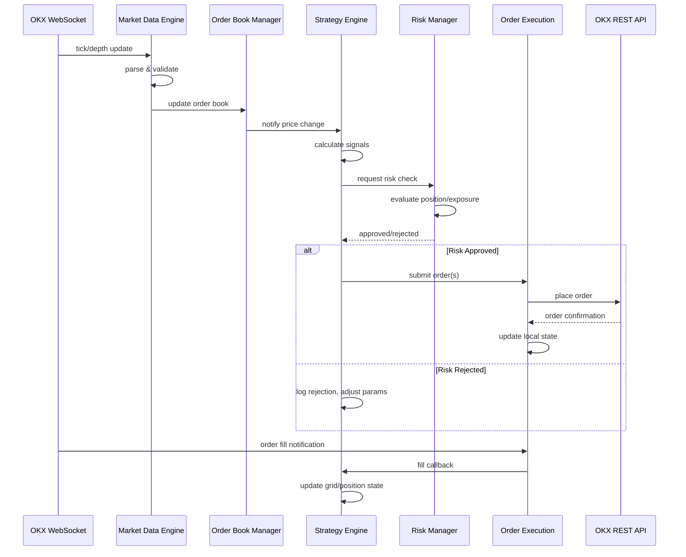
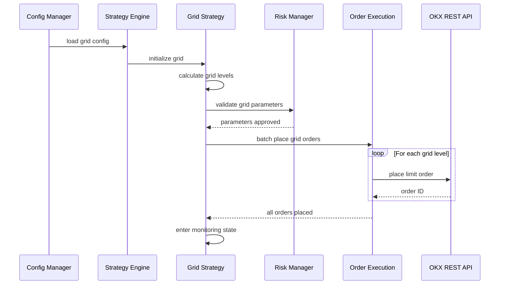

# Design Document: OKX Altcoin HFT Grid Trading System

## Overview

本系统是一个部署在东京服务器上的高频网格/均值回归交易系统，通过 OKX API 对山寨币进行自动化交易。系统核心目标是利用东京机房到 OKX 交易所的低延迟优势，在山寨币的价格波动中通过网格交易捕获利润，同时利用均值回归策略在价格偏离均值时进行反向操作。

系统设计遵循高频交易系统的核心原则：最小化延迟、最大化吞吐量、确保订单管理的原子性和一致性。硬件约束为 8 vCPU、16GB RAM、150-300GB NVMe SSD（Ubuntu 22.04/24.04），需要充分利用多核并行能力和高速存储的 IOPS 优势。

系统支持多币种并行交易，具备完整的风控体系、实时监控、故障恢复和性能统计功能。

## Architecture

```mermaid
graph TD
    subgraph External["外部系统"]
        OKX_WS["OKX WebSocket API<br/>(行情/订单推送)"]
        OKX_REST["OKX REST API<br/>(下单/查询)"]
    end

    subgraph Core["核心交易引擎"]
        MD["Market Data Engine<br/>(行情引擎)"]
        OB["Order Book Manager<br/>(订单簿管理)"]
        SE["Strategy Engine<br/>(策略引擎)"]
        OE["Order Execution Engine<br/>(订单执行引擎)"]
        RM["Risk Manager<br/>(风控管理)"]
    end

    subgraph Strategy["策略模块"]
        GS["Grid Strategy<br/>(网格策略)"]
        MR["Mean Reversion Strategy<br/>(均值回归策略)"]
        SS["Strategy Selector<br/>(策略选择器)"]
    end

    subgraph Infrastructure["基础设施"]
        DB["Time-Series DB<br/>(时序数据库)"]
        LOG["Logger<br/>(日志系统)"]
        MON["Monitor<br/>(监控告警)"]
        CFG["Config Manager<br/>(配置管理)"]
    end

    OKX_WS -->|"tick/depth"| MD
    MD --> OB
    OB --> SE
    SE --> SS
    SS --> GS
    SS --> MR
    GS --> OE
    MR --> OE
    OE -->|"place/cancel"| OKX_REST
    OKX_WS -->|"order updates"| OE
    SE --> RM
    RM -->|"risk check"| OE
    MD --> DB
    OE --> DB
    SE --> LOG
    RM --> MON
    CFG --> SE
    CFG --> RM
end
```

## Sequence Diagrams

### 主交易循环



### 网格初始化流程



## Components and Interfaces

### Component 1: Market Data Engine（行情引擎）

**Purpose**: 通过 WebSocket 接收 OKX 实时行情数据，解析、校验并分发给下游组件。

**Interface**:
```pascal
INTERFACE MarketDataEngine
  PROCEDURE connect(symbols: List[String])
  PROCEDURE disconnect()
  PROCEDURE subscribe(symbol: String, channel: String)
  PROCEDURE unsubscribe(symbol: String, channel: String)
  FUNCTION getLatestTick(symbol: String): TickData
  FUNCTION getOrderBook(symbol: String, depth: Integer): OrderBookSnapshot
  PROCEDURE registerCallback(event: EventType, handler: CallbackHandler)
END INTERFACE
```

**Responsibilities**:
- 维护与 OKX WebSocket 的长连接（含心跳和自动重连）
- 解析 ticker、depth、trades 等频道数据
- 数据校验（时间戳合理性、价格连续性）
- 以事件驱动方式通知 Order Book Manager 和 Strategy Engine
- 维护本地行情缓存，支持快速查询

---

### Component 2: Order Book Manager（订单簿管理）

**Purpose**: 维护每个交易对的本地订单簿快照，提供高效的价格查询和深度分析。

**Interface**:
```pascal
INTERFACE OrderBookManager
  PROCEDURE updateFromSnapshot(symbol: String, snapshot: OrderBookSnapshot)
  PROCEDURE updateIncremental(symbol: String, delta: OrderBookDelta)
  FUNCTION getBestBid(symbol: String): PriceLevel
  FUNCTION getBestAsk(symbol: String): PriceLevel
  FUNCTION getMidPrice(symbol: String): Decimal
  FUNCTION getSpread(symbol: String): Decimal
  FUNCTION getDepth(symbol: String, side: Side, levels: Integer): List[PriceLevel]
  FUNCTION getVWAP(symbol: String, quantity: Decimal): Decimal
END INTERFACE
```

**Responsibilities**:
- 增量更新本地订单簿
- 检测订单簿异常（交叉盘口、深度异常跳变）
- 计算 mid price、spread、VWAP 等衍生指标
- 订单簿快照序列号校验和自动恢复

---

### Component 3: Strategy Engine（策略引擎）

**Purpose**: 管理和调度所有交易策略，负责信号生成和订单决策。

**Interface**:
```pascal
INTERFACE StrategyEngine
  PROCEDURE loadStrategy(config: StrategyConfig)
  PROCEDURE startStrategy(strategyId: String)
  PROCEDURE stopStrategy(strategyId: String)
  PROCEDURE onMarketUpdate(symbol: String, tick: TickData)
  PROCEDURE onOrderFill(fill: FillEvent)
  FUNCTION getActiveStrategies(): List[StrategyStatus]
  FUNCTION getStrategyPnL(strategyId: String): PnLReport
END INTERFACE
```

**Responsibilities**:
- 管理多个策略实例的生命周期
- 将行情事件路由到对应策略
- 汇总策略信号并提交给风控审批
- 追踪每个策略的盈亏和状态

---

### Component 4: Order Execution Engine（订单执行引擎）

**Purpose**: 管理订单的全生命周期，与 OKX REST/WebSocket API 交互。

**Interface**:
```pascal
INTERFACE OrderExecutionEngine
  FUNCTION placeOrder(order: OrderRequest): OrderResult
  FUNCTION cancelOrder(orderId: String): CancelResult
  FUNCTION batchPlaceOrders(orders: List[OrderRequest]): List[OrderResult]
  FUNCTION batchCancelOrders(orderIds: List[String]): List[CancelResult]
  FUNCTION getOpenOrders(symbol: String): List[Order]
  FUNCTION getOrderStatus(orderId: String): OrderStatus
  PROCEDURE onOrderUpdate(update: OrderUpdateEvent)
  FUNCTION getPosition(symbol: String): Position
END INTERFACE
```

**Responsibilities**:
- 订单请求的队列化和速率限制
- 维护本地订单状态机（pending → open → partial → filled/cancelled）
- 处理 OKX 推送的订单更新
- 实现重试机制（网络超时、API 限频）
- 对账：定期与交易所同步订单/持仓状态

---

### Component 5: Risk Manager（风控管理）

**Purpose**: 实时监控交易风险，对策略的交易请求进行审批和限制。

**Interface**:
```pascal
INTERFACE RiskManager
  FUNCTION checkOrder(order: OrderRequest): RiskDecision
  FUNCTION checkBatchOrders(orders: List[OrderRequest]): RiskDecision
  PROCEDURE updatePosition(symbol: String, position: Position)
  PROCEDURE updatePnL(strategyId: String, pnl: Decimal)
  FUNCTION getRiskMetrics(): RiskMetrics
  PROCEDURE setRiskLimits(limits: RiskLimits)
  PROCEDURE emergencyStop(reason: String)
END INTERFACE
```

**Responsibilities**:
- 单笔/批量订单的风控审批
- 持仓限额监控（单币种/总持仓）
- 亏损限额监控（单策略/全局日亏损）
- 下单频率限制
- 紧急停止（emergency stop）机制
- 异常检测（闪崩、流动性枯竭）

## Data Models

### TickData（行情数据）

```pascal
STRUCTURE TickData
  symbol: String            -- 交易对, e.g. "BTC-USDT"
  timestamp: Integer        -- 微秒级时间戳
  lastPrice: Decimal        -- 最新成交价
  bestBid: Decimal          -- 最优买价
  bestAsk: Decimal          -- 最优卖价
  bidSize: Decimal          -- 最优买量
  askSize: Decimal          -- 最优卖量
  volume24h: Decimal        -- 24小时成交量
  sequenceId: Integer       -- 数据序列号
END STRUCTURE
```

**Validation Rules**:
- timestamp 必须在当前时间 ±5秒 范围内
- lastPrice、bestBid、bestAsk 必须为正数
- bestBid < bestAsk（无交叉盘口）
- sequenceId 必须单调递增

### GridConfig（网格配置）

```pascal
STRUCTURE GridConfig
  symbol: String            -- 交易对
  upperPrice: Decimal       -- 网格上界
  lowerPrice: Decimal       -- 网格下界
  gridCount: Integer        -- 网格数量
  gridType: GridType        -- ARITHMETIC | GEOMETRIC
  orderSize: Decimal        -- 每格下单量
  maxPosition: Decimal      -- 最大持仓量
  takeProfitRatio: Decimal  -- 止盈比例（可选）
  stopLossRatio: Decimal    -- 止损比例（可选）
  reinvestProfit: Boolean   -- 是否复投利润
END STRUCTURE

ENUMERATION GridType
  ARITHMETIC   -- 等差网格
  GEOMETRIC    -- 等比网格
END ENUMERATION
```

**Validation Rules**:
- upperPrice > lowerPrice
- gridCount >= 3 且 <= 500
- orderSize > 交易所最小下单量
- maxPosition > 0
- 0 < takeProfitRatio <= 1（如果设置）
- 0 < stopLossRatio <= 1（如果设置）

### MeanReversionConfig（均值回归配置）

```pascal
STRUCTURE MeanReversionConfig
  symbol: String            -- 交易对
  lookbackPeriod: Integer   -- 回看周期（秒）
  entryThreshold: Decimal   -- 入场偏离阈值（标准差倍数）
  exitThreshold: Decimal    -- 出场阈值
  maType: MAType            -- 均线类型
  orderSize: Decimal        -- 每次下单量
  maxPosition: Decimal      -- 最大持仓量
  cooldownMs: Integer       -- 信号冷却时间（毫秒）
END STRUCTURE

ENUMERATION MAType
  SMA    -- 简单移动平均
  EMA    -- 指数移动平均
  VWAP   -- 成交量加权均价
END ENUMERATION
```

### Order（订单）

```pascal
STRUCTURE Order
  orderId: String           -- 本地订单ID
  exchangeOrderId: String   -- 交易所订单ID
  symbol: String            -- 交易对
  side: Side                -- BUY | SELL
  orderType: OrderType      -- LIMIT | MARKET | POST_ONLY
  price: Decimal            -- 委托价格
  quantity: Decimal         -- 委托数量
  filledQuantity: Decimal   -- 已成交数量
  avgFillPrice: Decimal     -- 平均成交价
  status: OrderStatus       -- 订单状态
  strategyId: String        -- 关联策略ID
  createTime: Integer       -- 创建时间戳
  updateTime: Integer       -- 更新时间戳
END STRUCTURE

ENUMERATION Side
  BUY
  SELL
END ENUMERATION

ENUMERATION OrderType
  LIMIT
  MARKET
  POST_ONLY
END ENUMERATION

ENUMERATION OrderStatus
  PENDING         -- 等待提交
  SUBMITTED       -- 已提交
  OPEN            -- 已挂单
  PARTIALLY_FILLED -- 部分成交
  FILLED          -- 完全成交
  CANCELLED       -- 已撤销
  REJECTED        -- 被拒绝
  EXPIRED         -- 已过期
END ENUMERATION
```

### Position（持仓）

```pascal
STRUCTURE Position
  symbol: String            -- 交易对
  side: Side                -- 持仓方向
  quantity: Decimal         -- 持仓数量
  avgEntryPrice: Decimal    -- 平均入场价
  unrealizedPnL: Decimal    -- 未实现盈亏
  realizedPnL: Decimal      -- 已实现盈亏
  lastUpdateTime: Integer   -- 最后更新时间
END STRUCTURE
```

### RiskLimits（风控限制）

```pascal
STRUCTURE RiskLimits
  maxPositionPerSymbol: Decimal    -- 单币种最大持仓（USDT计）
  maxTotalPosition: Decimal        -- 总最大持仓
  maxDailyLoss: Decimal            -- 单日最大亏损
  maxStrategyLoss: Decimal         -- 单策略最大亏损
  maxOrdersPerSecond: Integer      -- 每秒最大下单数
  maxOpenOrders: Integer           -- 最大挂单数
  minSpreadBps: Integer            -- 最小价差（基点）
  emergencyStopLoss: Decimal       -- 紧急止损线
END STRUCTURE
```

## Algorithmic Pseudocode

### Algorithm 1: Grid Level Calculation（网格价位计算）

```pascal
ALGORITHM calculateGridLevels(config)
INPUT: config of type GridConfig
OUTPUT: levels of type List[GridLevel]

BEGIN
  ASSERT config.upperPrice > config.lowerPrice
  ASSERT config.gridCount >= 3

  levels ← EMPTY LIST

  IF config.gridType = ARITHMETIC THEN
    -- 等差网格：价格等间距
    step ← (config.upperPrice - config.lowerPrice) / config.gridCount
    
    FOR i FROM 0 TO config.gridCount DO
      -- Loop Invariant: levels contains exactly i elements, all prices ascending
      price ← config.lowerPrice + (i * step)
      level ← GridLevel(index: i, price: price, hasBuyOrder: FALSE, hasSellOrder: FALSE)
      levels.append(level)
    END FOR

  ELSE IF config.gridType = GEOMETRIC THEN
    -- 等比网格：价格等比间距
    ratio ← (config.upperPrice / config.lowerPrice) ^ (1 / config.gridCount)
    
    FOR i FROM 0 TO config.gridCount DO
      -- Loop Invariant: levels contains exactly i elements, each price = prev * ratio
      price ← config.lowerPrice * (ratio ^ i)
      level ← GridLevel(index: i, price: price, hasBuyOrder: FALSE, hasSellOrder: FALSE)
      levels.append(level)
    END FOR
  END IF

  ASSERT LENGTH(levels) = config.gridCount + 1
  ASSERT levels[0].price = config.lowerPrice
  ASSERT ABS(levels[LAST].price - config.upperPrice) < EPSILON

  RETURN levels
END
```

**Preconditions:**
- config.upperPrice > config.lowerPrice
- config.gridCount >= 3
- config.gridType ∈ {ARITHMETIC, GEOMETRIC}

**Postconditions:**
- 返回 gridCount + 1 个 GridLevel
- 所有价格严格递增
- levels[0].price = lowerPrice
- levels[last].price ≈ upperPrice

**Loop Invariants:**
- 已生成的 levels 数量等于当前循环索引
- 所有已生成 levels 的价格严格递增

---

### Algorithm 2: Grid Order Placement（网格订单布局）

```pascal
ALGORITHM placeGridOrders(levels, currentPrice, config)
INPUT: levels of type List[GridLevel], currentPrice of type Decimal, config of type GridConfig
OUTPUT: orders of type List[OrderRequest]

BEGIN
  ASSERT LENGTH(levels) >= 4
  ASSERT currentPrice >= levels[0].price
  ASSERT currentPrice <= levels[LAST].price

  orders ← EMPTY LIST
  
  -- 找到当前价格所在的网格区间
  currentIndex ← findGridIndex(levels, currentPrice)

  -- 在当前价格下方放买单，上方放卖单
  FOR i FROM 0 TO LENGTH(levels) - 1 DO
    -- Loop Invariant: orders list contains valid buy/sell orders for processed levels
    IF levels[i].price < currentPrice THEN
      -- 下方放限价买单
      buyOrder ← OrderRequest(
        symbol: config.symbol,
        side: BUY,
        orderType: POST_ONLY,
        price: levels[i].price,
        quantity: config.orderSize,
        gridLevel: i
      )
      orders.append(buyOrder)
      levels[i].hasBuyOrder ← TRUE

    ELSE IF levels[i].price > currentPrice THEN
      -- 上方放限价卖单
      sellOrder ← OrderRequest(
        symbol: config.symbol,
        side: SELL,
        orderType: POST_ONLY,
        price: levels[i].price,
        quantity: config.orderSize,
        gridLevel: i
      )
      orders.append(sellOrder)
      levels[i].hasSellOrder ← TRUE
    END IF
  END FOR

  ASSERT LENGTH(orders) = LENGTH(levels) - 1  -- 除当前价格所在格外
  RETURN orders
END
```

**Preconditions:**
- levels 已按价格升序排列
- currentPrice 在网格范围内
- config.orderSize > 交易所最小数量

**Postconditions:**
- 当前价格下方全部为买单
- 当前价格上方全部为卖单
- 每一格最多一个订单
- 所有订单使用 POST_ONLY 类型（避免吃单手续费）

**Loop Invariants:**
- 已处理的 levels 中，低于 currentPrice 的都标记了 hasBuyOrder
- 已处理的 levels 中，高于 currentPrice 的都标记了 hasSellOrder

---

### Algorithm 3: Grid Fill Handler（网格成交处理）

```pascal
ALGORITHM handleGridFill(fill, gridState, config)
INPUT: fill of type FillEvent, gridState of type GridState, config of type GridConfig
OUTPUT: newOrder of type OrderRequest OR NULL

BEGIN
  ASSERT fill.status = FILLED OR fill.status = PARTIALLY_FILLED
  ASSERT fill.gridLevel >= 0 AND fill.gridLevel < LENGTH(gridState.levels)

  level ← gridState.levels[fill.gridLevel]
  
  IF fill.side = BUY THEN
    -- 买单成交 → 在上一格放卖单（获利出场）
    targetLevel ← fill.gridLevel + 1
    
    IF targetLevel < LENGTH(gridState.levels) THEN
      sellPrice ← gridState.levels[targetLevel].price
      
      -- 计算利润（考虑手续费）
      expectedProfit ← (sellPrice - fill.price) * fill.quantity
      fees ← fill.quantity * fill.price * FEE_RATE * 2  -- 买卖双向手续费
      netProfit ← expectedProfit - fees
      
      IF netProfit > 0 THEN
        newOrder ← OrderRequest(
          symbol: config.symbol,
          side: SELL,
          orderType: POST_ONLY,
          price: sellPrice,
          quantity: fill.quantity,
          gridLevel: targetLevel
        )
        gridState.levels[targetLevel].hasSellOrder ← TRUE
        gridState.totalBuys ← gridState.totalBuys + 1
        
        RETURN newOrder
      END IF
    END IF

  ELSE IF fill.side = SELL THEN
    -- 卖单成交 → 在下一格放买单（重新建仓）
    targetLevel ← fill.gridLevel - 1
    
    IF targetLevel >= 0 THEN
      buyPrice ← gridState.levels[targetLevel].price
      
      newOrder ← OrderRequest(
        symbol: config.symbol,
        side: BUY,
        orderType: POST_ONLY,
        price: buyPrice,
        quantity: fill.quantity,
        gridLevel: targetLevel
      )
      gridState.levels[targetLevel].hasBuyOrder ← TRUE
      gridState.totalSells ← gridState.totalSells + 1
      gridState.realizedPnL ← gridState.realizedPnL + (fill.price - gridState.avgBuyPrice) * fill.quantity
      
      RETURN newOrder
    END IF
  END IF

  RETURN NULL
END
```

**Preconditions:**
- fill 是有效的成交事件
- gridState 与当前活跃的网格一致
- fill.gridLevel 在有效范围内

**Postconditions:**
- 如果返回非 NULL，新订单在相邻格位
- gridState 统计数据已更新
- 卖出时 realizedPnL 已累加

**Loop Invariants:** N/A（无循环）

---

### Algorithm 4: Mean Reversion Signal（均值回归信号计算）

```pascal
ALGORITHM calculateMeanReversionSignal(priceHistory, config)
INPUT: priceHistory of type List[TickData], config of type MeanReversionConfig
OUTPUT: signal of type TradingSignal

BEGIN
  ASSERT LENGTH(priceHistory) >= config.lookbackPeriod
  
  -- Step 1: 计算移动平均值
  prices ← extractPrices(priceHistory, config.lookbackPeriod)
  
  IF config.maType = SMA THEN
    mean ← SUM(prices) / LENGTH(prices)
  ELSE IF config.maType = EMA THEN
    alpha ← 2 / (config.lookbackPeriod + 1)
    mean ← calculateEMA(prices, alpha)
  ELSE IF config.maType = VWAP THEN
    mean ← calculateVWAP(priceHistory, config.lookbackPeriod)
  END IF

  -- Step 2: 计算标准差
  variance ← 0
  FOR each price IN prices DO
    -- Loop Invariant: variance accumulates squared deviations of processed prices
    variance ← variance + (price - mean) ^ 2
  END FOR
  variance ← variance / LENGTH(prices)
  stdDev ← SQRT(variance)

  -- Step 3: 计算 Z-Score（偏离程度）
  currentPrice ← priceHistory[LAST].lastPrice
  
  IF stdDev > 0 THEN
    zScore ← (currentPrice - mean) / stdDev
  ELSE
    zScore ← 0
  END IF

  -- Step 4: 生成交易信号
  signal ← TradingSignal(direction: NONE, strength: 0, zScore: zScore)

  IF zScore < -config.entryThreshold THEN
    -- 价格低于均值过多 → 买入信号
    signal.direction ← BUY
    signal.strength ← ABS(zScore) / config.entryThreshold
  ELSE IF zScore > config.entryThreshold THEN
    -- 价格高于均值过多 → 卖出信号
    signal.direction ← SELL
    signal.strength ← ABS(zScore) / config.entryThreshold
  ELSE IF ABS(zScore) < config.exitThreshold THEN
    -- 价格回归均值 → 平仓信号
    signal.direction ← CLOSE
    signal.strength ← 1 - (ABS(zScore) / config.exitThreshold)
  END IF

  ASSERT signal.strength >= 0
  RETURN signal
END
```

**Preconditions:**
- priceHistory 包含足够的历史数据（>= lookbackPeriod）
- config.entryThreshold > config.exitThreshold > 0
- config.lookbackPeriod > 0

**Postconditions:**
- signal.zScore 反映当前价格相对均值的偏离程度
- signal.direction ∈ {BUY, SELL, CLOSE, NONE}
- signal.strength ∈ [0, +∞)，值越大信号越强

**Loop Invariants:**
- variance 始终为已处理价格的偏差平方和

---

### Algorithm 5: Risk Check（风控检查）

```pascal
ALGORITHM performRiskCheck(orderRequest, riskState, limits)
INPUT: orderRequest of type OrderRequest, riskState of type RiskState, limits of type RiskLimits
OUTPUT: decision of type RiskDecision

BEGIN
  ASSERT orderRequest IS NOT NULL
  ASSERT limits IS NOT NULL

  reasons ← EMPTY LIST

  -- Check 1: 持仓限额
  currentPosition ← riskState.positions[orderRequest.symbol]
  newExposure ← currentPosition.quantity * currentPosition.avgEntryPrice
  orderExposure ← orderRequest.quantity * orderRequest.price
  
  IF orderRequest.side = BUY THEN
    totalExposure ← newExposure + orderExposure
  ELSE
    totalExposure ← newExposure - orderExposure
  END IF

  IF ABS(totalExposure) > limits.maxPositionPerSymbol THEN
    reasons.append("Exceeds per-symbol position limit")
  END IF

  -- Check 2: 总持仓限额
  totalPortfolioExposure ← calculateTotalExposure(riskState.positions)
  IF totalPortfolioExposure + orderExposure > limits.maxTotalPosition THEN
    reasons.append("Exceeds total position limit")
  END IF

  -- Check 3: 日亏损限额
  IF riskState.dailyPnL < -limits.maxDailyLoss THEN
    reasons.append("Daily loss limit reached")
  END IF

  -- Check 4: 下单频率限制
  recentOrderCount ← countOrdersInWindow(riskState.orderTimestamps, 1000)  -- 1秒窗口
  IF recentOrderCount >= limits.maxOrdersPerSecond THEN
    reasons.append("Order rate limit exceeded")
  END IF

  -- Check 5: 挂单数量限制
  openOrderCount ← LENGTH(riskState.openOrders[orderRequest.symbol])
  IF openOrderCount >= limits.maxOpenOrders THEN
    reasons.append("Max open orders reached")
  END IF

  -- Check 6: 最小价差检查
  spread ← riskState.currentSpreads[orderRequest.symbol]
  IF spread < limits.minSpreadBps THEN
    reasons.append("Spread too narrow, skip trading")
  END IF

  -- Final decision
  IF LENGTH(reasons) = 0 THEN
    decision ← RiskDecision(approved: TRUE, reasons: EMPTY)
  ELSE
    decision ← RiskDecision(approved: FALSE, reasons: reasons)
  END IF

  RETURN decision
END
```

**Preconditions:**
- orderRequest 包含有效的订单参数
- riskState 反映最新的持仓和盈亏状态
- limits 已正确配置

**Postconditions:**
- decision.approved = TRUE 当且仅当所有风控检查通过
- decision.reasons 包含所有拒绝原因
- riskState 未被修改（只读检查）

**Loop Invariants:** N/A

---

### Algorithm 6: Rate Limiter（速率限制器）

```pascal
ALGORITHM rateLimitedExecute(request, rateLimiter)
INPUT: request of type APIRequest, rateLimiter of type RateLimiter
OUTPUT: response of type APIResponse

BEGIN
  ASSERT request IS NOT NULL
  
  -- OKX API 限制: 通常 20 次/2秒（REST），取决于端点
  maxRetries ← 3
  retryCount ← 0

  WHILE retryCount < maxRetries DO
    -- Loop Invariant: retryCount < maxRetries, previous attempts either rate-limited or failed
    
    -- 获取令牌（令牌桶算法）
    tokenAvailable ← rateLimiter.tryAcquire(1)
    
    IF NOT tokenAvailable THEN
      waitTime ← rateLimiter.getNextAvailableTime()
      SLEEP(waitTime)
      CONTINUE
    END IF

    response ← executeAPICall(request)

    IF response.statusCode = 429 THEN
      -- 被限频，指数退避
      retryCount ← retryCount + 1
      backoffMs ← MIN(100 * (2 ^ retryCount), 5000)
      SLEEP(backoffMs)
    ELSE IF response.statusCode >= 500 THEN
      -- 服务器错误，重试
      retryCount ← retryCount + 1
      SLEEP(100)
    ELSE
      RETURN response
    END IF
  END WHILE

  -- 所有重试用尽
  RETURN ErrorResponse("Rate limit exceeded after retries")
END
```

**Preconditions:**
- rateLimiter 已按 OKX API 限额配置
- request 是合法的 API 请求

**Postconditions:**
- 成功时返回有效的 API 响应
- 失败时返回错误响应
- 总等待时间不超过合理上限

**Loop Invariants:**
- retryCount 单调递增
- 每次循环要么返回结果，要么增加 retryCount

## Key Functions with Formal Specifications

### Function: initializeSystem()

```pascal
PROCEDURE initializeSystem(config)
  INPUT: config of type SystemConfig
  OUTPUT: system of type TradingSystem
```

**Preconditions:**
- config 包含有效的 API credentials
- config 包含至少一个策略配置
- 网络连接到 OKX 可用

**Postconditions:**
- WebSocket 连接已建立
- 所有策略已加载但未启动
- 风控参数已初始化
- 日志系统已启动

---

### Function: processMarketEvent()

```pascal
PROCEDURE processMarketEvent(event, system)
  INPUT: event of type MarketEvent, system of type TradingSystem
  OUTPUT: actions of type List[TradeAction]
```

**Preconditions:**
- event.timestamp 在合理范围内
- system 处于 RUNNING 状态
- event.symbol 在已订阅列表中

**Postconditions:**
- Order Book 已更新
- 所有相关策略已收到通知
- actions 中的每个 TradeAction 已通过风控检查
- 处理延迟 < 1ms（目标）

---

### Function: reconcileState()

```pascal
PROCEDURE reconcileState(system)
  INPUT: system of type TradingSystem
  OUTPUT: discrepancies of type List[Discrepancy]
```

**Preconditions:**
- system 至少已运行 1 分钟
- REST API 可用

**Postconditions:**
- 本地订单状态与交易所一致
- 本地持仓与交易所一致
- 所有不一致已记录并尝试修复
- 无法修复的不一致触发告警

---

### Function: calculateEMA()

```pascal
FUNCTION calculateEMA(prices, alpha)
  INPUT: prices of type List[Decimal], alpha of type Decimal
  OUTPUT: ema of type Decimal
```

**Preconditions:**
- LENGTH(prices) >= 1
- 0 < alpha < 1

**Postconditions:**
- ema 是加权后的指数移动平均
- 近期价格权重更大
- 结果在 MIN(prices) 和 MAX(prices) 之间

---

### Function: findGridIndex()

```pascal
FUNCTION findGridIndex(levels, price)
  INPUT: levels of type List[GridLevel], price of type Decimal
  OUTPUT: index of type Integer
```

**Preconditions:**
- levels 按 price 升序排列
- price >= levels[0].price
- price <= levels[LAST].price

**Postconditions:**
- levels[index].price <= price < levels[index+1].price
- 0 <= index < LENGTH(levels) - 1

## Example Usage

```pascal
-- Example 1: 初始化并启动网格策略
SEQUENCE
  config ← loadConfig("config.yaml")
  system ← initializeSystem(config)
  
  -- 设置网格参数
  gridConfig ← GridConfig(
    symbol: "DOGE-USDT",
    upperPrice: 0.10,
    lowerPrice: 0.06,
    gridCount: 40,
    gridType: ARITHMETIC,
    orderSize: 1000,
    maxPosition: 50000,
    reinvestProfit: TRUE
  )
  
  -- 计算网格价位
  levels ← calculateGridLevels(gridConfig)
  
  -- 获取当前价格
  currentTick ← system.marketData.getLatestTick("DOGE-USDT")
  
  -- 布局网格订单
  orders ← placeGridOrders(levels, currentTick.lastPrice, gridConfig)
  
  -- 通过风控后批量下单
  FOR each order IN orders DO
    decision ← system.riskManager.checkOrder(order)
    IF decision.approved THEN
      system.execution.placeOrder(order)
    END IF
  END FOR
END SEQUENCE

-- Example 2: 均值回归策略运行
SEQUENCE
  mrConfig ← MeanReversionConfig(
    symbol: "SOL-USDT",
    lookbackPeriod: 300,
    entryThreshold: 2.0,
    exitThreshold: 0.5,
    maType: EMA,
    orderSize: 10,
    maxPosition: 100,
    cooldownMs: 5000
  )
  
  -- 收集历史价格
  priceHistory ← system.marketData.getHistory("SOL-USDT", 300)
  
  -- 计算信号
  signal ← calculateMeanReversionSignal(priceHistory, mrConfig)
  
  IF signal.direction = BUY AND signal.strength > 1.5 THEN
    order ← OrderRequest(
      symbol: "SOL-USDT",
      side: BUY,
      orderType: LIMIT,
      price: priceHistory[LAST].bestAsk,
      quantity: mrConfig.orderSize
    )
    system.execution.placeOrder(order)
  END IF
END SEQUENCE

-- Example 3: 紧急停止
SEQUENCE
  riskMetrics ← system.riskManager.getRiskMetrics()
  
  IF riskMetrics.dailyPnL < -riskMetrics.emergencyStopLoss THEN
    system.riskManager.emergencyStop("Daily loss exceeded emergency threshold")
    -- 撤销所有挂单
    openOrders ← system.execution.getAllOpenOrders()
    system.execution.batchCancelOrders(openOrders.map(o → o.orderId))
    -- 发送告警
    system.monitor.sendAlert(CRITICAL, "Emergency stop triggered")
  END IF
END SEQUENCE
```

## Correctness Properties

*A property is a characteristic or behavior that should hold true across all valid executions of a system — essentially, a formal statement about what the system should do. Properties serve as the bridge between human-readable specifications and machine-verifiable correctness guarantees.*

### Property 1: Tick Data Validation Completeness

*For any* incoming tick data, the Market_Data_Engine validation SHALL accept the data if and only if: lastPrice > 0 and <= 99,999,999.99, bestBid > 0 and <= 99,999,999.99, bestAsk > 0 and <= 99,999,999.99, bestBid < bestAsk, timestamp is within 5 seconds of server time, and sequenceId is strictly greater than the previous sequenceId for that symbol. Invalid ticks SHALL be discarded entirely without forwarding to any downstream component.

**Validates: Requirements 1.3, 1.4, 1.5, 9.1, 9.2, 9.3, 9.4**

### Property 2: Grid Level Monotonicity and Structure

*For any* valid GridConfig (upperPrice > lowerPrice, gridCount in [3, 500]), the calculated grid levels SHALL be exactly gridCount + 1 in count, all prices strictly ascending, first price equal to lowerPrice, and last price equal to upperPrice (within a tolerance of 1e-9 relative to the price range).

**Validates: Requirements 3.3, 3.4, 3.5**

### Property 3: Grid Arithmetic Equal Intervals

*For any* valid GridConfig with ARITHMETIC type, the difference between any two adjacent grid level prices SHALL be constant and equal to (upperPrice - lowerPrice) / gridCount.

**Validates: Requirement 3.1**

### Property 4: Grid Geometric Equal Ratios

*For any* valid GridConfig with GEOMETRIC type, the ratio between any two adjacent grid level prices SHALL be constant and equal to (upperPrice / lowerPrice) ^ (1 / gridCount).

**Validates: Requirement 3.2**

### Property 5: Grid Order Direction Consistency

*For any* grid placement with a current price within the grid range, all orders placed at levels strictly below the current price SHALL be BUY orders, all orders at levels strictly above the current price SHALL be SELL orders, no order SHALL be placed at a level equal to the current price, and all orders SHALL use POST_ONLY type.

**Validates: Requirements 3.6, 3.7**

### Property 6: Grid Level Mutual Exclusion

*For any* grid level at any point during operation, the level SHALL NOT simultaneously have both a buy order and a sell order active.

**Validates: Requirement 3.8**

### Property 7: Grid Fill Counter-Order Placement

*For any* buy fill at grid level N (where N < max level), a sell order SHALL be placed at level N+1 with the same quantity as the filled buy order. *For any* sell fill at grid level N (where N > 0), a buy order SHALL be placed at level N-1 with the same quantity as the filled sell order. *For any* fill at boundary levels (highest for SELL, lowest for BUY), no counter order SHALL be placed beyond the grid boundary.

**Validates: Requirements 4.1, 4.2, 4.6**

### Property 8: Grid Profit Guarantee

*For any* grid buy-sell trade pair at adjacent levels, the counter sell order SHALL only be placed if the net profit (sell_price - buy_price) * quantity exceeds double the single-side trading fee * quantity * 2. If the profit check fails, the counter sell order SHALL be skipped.

**Validates: Requirement 4.3**

### Property 9: Grid Position Bound

*For any* sequence of grid operations, the absolute position quantity SHALL never exceed the configured maxPosition value. If placing a counter BUY order would cause total position to exceed maxPosition, that order SHALL be skipped.

**Validates: Requirements 4.5**

### Property 10: Mean Reversion Signal Direction

*For any* price history and MeanReversionConfig with sufficient data (>= lookbackPeriod), the signal direction SHALL be: BUY when Z_Score < -entryThreshold, SELL when Z_Score > +entryThreshold, CLOSE when |Z_Score| < exitThreshold with open position, and NONE otherwise. If standard deviation is zero, signal generation SHALL be suppressed.

**Validates: Requirements 5.3, 5.4, 5.6, 5.7, 5.8**

### Property 11: EMA Boundedness

*For any* non-empty price series and valid alpha (0 < alpha < 1), the computed EMA value SHALL be between MIN(prices) and MAX(prices) inclusive.

**Validates: Requirement 5.2**

### Property 12: Signal Cooldown Enforcement

*For any* two consecutive signals generated by the Mean_Reversion_Strategy, the time difference between them SHALL be at least cooldownMs milliseconds (where cooldownMs is in range 100 to 60000).

**Validates: Requirement 5.9**

### Property 13: Order State Machine Validity

*For any* order and any sequence of status update events, the order status transitions SHALL only follow the defined state machine (PENDING → SUBMITTED → OPEN → PARTIALLY_FILLED → FILLED | CANCELLED | EXPIRED), and any invalid transition SHALL be rejected while preserving the current order status unchanged.

**Validates: Requirements 6.1, 6.2**

### Property 14: Risk Check Position Limit

*For any* order approved by the Risk_Manager, the post-order position exposure (total position quantity × current market price) for that symbol SHALL NOT exceed maxPositionPerSymbol, and the total portfolio exposure (sum of absolute notional exposure across all symbols) SHALL NOT exceed maxTotalPosition.

**Validates: Requirements 7.1, 7.2**

### Property 15: Risk Check Daily Loss Limit

*For any* risk state where dailyPnL (realized PnL plus mark-to-market unrealized PnL) has reached or exceeded the negative maxDailyLoss threshold, the Risk_Manager SHALL reject all subsequent order requests until the next trading-day start time.

**Validates: Requirement 7.3**

### Property 16: Risk Check Order Rate Limit

*For any* 1-second sliding window of approved orders, the count SHALL NOT exceed maxOrdersPerSecond.

**Validates: Requirement 7.4**

### Property 17: Emergency Stop Irreversibility

*For any* system state where Emergency_Stop has been triggered (daily PnL below negative emergencyStopLoss), all trading operation requests SHALL be rejected until manual confirmation is received to resume. Emergency_Stop trigger SHALL cancel all open orders, halt all strategies, and send a CRITICAL alert within 1 second.

**Validates: Requirements 7.7, 7.8, 7.9**

### Property 18: Rate Limiter Invariant

*For any* sequence of API requests, no endpoint SHALL receive more requests than its configured limit within any 2-second measurement window. Separate token buckets SHALL be maintained for each distinct API endpoint. When a token is unavailable, blocking SHALL not exceed 5 seconds before returning a timeout error.

**Validates: Requirements 8.1, 8.2, 8.3, 8.5, 8.6**

### Property 19: Configuration Validation

*For any* GridConfig, the system SHALL accept it if and only if upperPrice > lowerPrice, gridCount is in [3, 500], and orderSize >= exchange minimum for the target trading pair. *For any* MeanReversionConfig, the system SHALL accept it if and only if entryThreshold > exitThreshold, entryThreshold is within [1.0, 5.0], exitThreshold is within [0.1, 2.0], and lookbackPeriod is in [10, 500]. Invalid configurations SHALL be rejected with an error message indicating which specific field failed and why.

**Validates: Requirements 3.9, 5.10, 5.11, 9.5, 9.6, 9.7**

### Property 20: State Persistence Round-Trip

*For any* valid system state (orders, positions, strategy state), persisting to local storage and then reloading SHALL produce an equivalent state object. Maximum data loss on unexpected termination SHALL be bounded to 1 second of state changes.

**Validates: Requirements 10.2, 10.3**

### Property 21: Ring Buffer Capacity Bound

*For any* sequence of N insertions into a ring buffer of capacity C (where N > C), the buffer size SHALL remain exactly C and contain the most recent C entries. Default capacity is 1,000,000 records per instrument.

**Validates: Requirement 10.4**

### Property 22: Order Book Mid Price and Spread

*For any* valid order book with bestBid < bestAsk, the mid price SHALL equal (bestBid + bestAsk) / 2 with up to 8 decimal places of precision, and the spread SHALL equal bestAsk - bestBid as a non-negative value with up to 8 decimal places of precision.

**Validates: Requirements 2.3, 2.5**

### Property 23: Extreme Market Condition Detection

*For any* price sequence where the price change exceeds 5% within 1 minute, or spread exceeds 3 times the rolling 5-minute average spread, the system SHALL detect this as an extreme market condition and trigger protective actions (cancel grid orders, pause mean reversion strategy).

**Validates: Requirement 14.4**

### Property 24: Log Sanitization

*For any* log event containing API key, secret key, passphrase, or any string matching configured credential patterns, the sanitized log output SHALL NOT contain the secret values, replacing them with a fixed-length mask of 8 asterisk characters.

**Validates: Requirement 13.4**

### Property 25: HMAC-SHA256 Request Signing

*For any* API request payload, signing with HMAC-SHA256 and verifying the signature SHALL produce a consistent and valid result (sign-then-verify round trip). The timestamp included in the signed request SHALL be within 30 seconds of current server time.

**Validates: Requirement 13.2**

### Property 26: Order Book Incremental Update Correctness

*For any* valid order book state and any incremental update, applying the delta SHALL correctly insert new price levels, update quantities for existing levels, and remove levels where quantity equals zero. The resulting book SHALL maintain bids in descending order and asks in ascending order.

**Validates: Requirements 2.1, 2.2**

### Property 27: Order Book VWAP Calculation

*For any* valid order book with non-zero depth on the specified side and any requested quantity that does not exceed available depth, the VWAP calculation SHALL walk from the best price level accumulating volume and return the correct volume-weighted average price across all consumed levels.

**Validates: Requirement 2.6**

### Property 28: Order Book Sequence Gap Detection

*For any* incremental update where the sequence number is not exactly 1 greater than the last processed sequence number, the Order_Book_Manager SHALL discard the local book for that symbol. During resynchronization, all incremental updates SHALL be discarded until a new full snapshot is applied.

**Validates: Requirements 2.9, 2.10**

### Property 29: Order Book Anomaly Detection

*For any* order book update resulting in a crossed book (bestBid >= bestAsk) or depth change exceeding 50% of total levels in a single update, the Order_Book_Manager SHALL detect the anomaly and request a full resynchronization.

**Validates: Requirement 2.8**

### Property 30: Batch Order Size Limit

*For any* batch order placement request, the Order_Execution_Engine SHALL submit no more than 20 orders per batch, splitting larger batches as needed while respecting the OKX API rate limit.

**Validates: Requirement 6.4**

### Property 31: Reconciliation Exchange Authority

*For any* discrepancy detected between local and exchange order state during reconciliation, the Order_Execution_Engine SHALL update the local state to match the exchange state (exchange is authoritative).

**Validates: Requirement 6.8**

### Property 32: Risk Check Open Orders and Spread Limits

*For any* order request where the number of open orders for that symbol has reached maxOpenOrders, the Risk_Manager SHALL reject the request. *For any* order request where the current spread for that symbol is less than minSpreadBps, the Risk_Manager SHALL reject the request.

**Validates: Requirements 7.5, 7.6**

### Property 33: Grid Realized PnL Calculation

*For any* grid SELL order fill, the realized PnL SHALL be updated by adding (fill_price - volume_weighted_average_buy_price) * fill_quantity.

**Validates: Requirement 4.4**

### Property 34: Credential Startup Validation

*For any* system startup, the system SHALL validate that all required API credentials (API key, secret key, passphrase) are present and non-empty, refusing to start if any credential is missing.

**Validates: Requirement 13.7**

### Property 35: Trading Action Log Completeness

*For any* trading action (order placed, fill, cancellation) logged by the system, the log entry SHALL contain: timestamp (millisecond precision), action type, instrument identifier, quantity, price, order ID, and action result.

**Validates: Requirement 11.4**

## Error Handling

### Error Scenario 1: WebSocket 断连

**Condition**: 与 OKX WebSocket 的连接中断（网络波动、服务器维护）
**Detection**: 心跳超时 (>30s 无响应) 或连接异常关闭
**Response**:
1. 立即标记所有行情数据为 STALE
2. 暂停所有策略的新订单生成
3. 保留当前挂单不动（避免不必要撤单）
4. 启动指数退避重连（初始 1s，最大 60s）
**Recovery**:
1. 重连成功后重新订阅所有频道
2. 请求订单簿全量快照
3. 验证数据连续性（sequenceId）
4. 确认数据新鲜后恢复策略

### Error Scenario 2: 订单被拒绝

**Condition**: OKX API 返回订单拒绝（资金不足、价格无效、参数错误）
**Detection**: API response code != 0
**Response**:
1. 记录拒绝原因和订单详情
2. 根据错误码分类处理：
   - 余额不足 → 重新计算可用资金，缩减订单量
   - 价格无效 → 检查最新价格，调整订单价格
   - 频率限制 → 等待并重试
3. 更新本地订单状态为 REJECTED
**Recovery**: 在下一个行情更新时重新评估是否需要下单

### Error Scenario 3: 闪崩/极端行情

**Condition**: 价格在短时间内剧烈变动（如 >5% / 1分钟）
**Detection**: 
- 价格变动幅度超过历史波动率的 N 倍
- 盘口深度骤减
- 价差异常扩大
**Response**:
1. 触发风控紧急模式
2. 撤销所有网格挂单（避免在极端价格成交）
3. 暂停均值回归策略（统计特征失效）
4. 发送告警通知
**Recovery**:
1. 等待波动率回归正常水平
2. 重新评估网格范围是否需要调整
3. 人工确认后恢复策略

### Error Scenario 4: 持仓/订单状态不一致

**Condition**: 本地状态与交易所实际状态不匹配
**Detection**: 定期对账（每 60 秒）发现差异
**Response**:
1. 以交易所状态为准修正本地状态
2. 记录不一致详情（用于后续分析）
3. 检查是否有遗漏的成交（missed fills）
4. 如果差异较大，暂停策略等待人工确认
**Recovery**: 状态同步完成后恢复正常运行

## Testing Strategy

### Unit Testing Approach

**关键单元测试用例**:
- 网格价位计算（等差/等比，边界值）
- 均值回归信号计算（各种 zScore 场景）
- 风控规则检查（每条规则的通过/拒绝）
- 订单状态机转换
- 速率限制器行为

**Coverage Goals**: 核心算法 100% 分支覆盖

### Property-Based Testing Approach

**Property Test Library**: fast-check (或 Hypothesis for Python)

**Key Properties to Test**:
1. 网格计算：任意合法参数下，生成的网格价位单调递增且在范围内
2. 均值回归：zScore 计算结果与手动计算一致
3. 风控：任何通过风控的订单不会导致违规状态
4. 订单状态机：任意事件序列不会导致非法状态转换
5. 速率限制器：在任意请求模式下不超过配额

### Integration Testing Approach

- OKX API 模拟器（mock server）用于端到端测试
- 使用 OKX 测试网（testnet）验证实际连接
- 行情回放测试：使用历史数据验证策略行为
- 故障注入测试：模拟断连、超时、拒绝等场景

## Performance Considerations

### 延迟目标

| 环节 | 目标延迟 | 测量方式 |
|------|---------|---------|
| 行情接收到解析完成 | < 100μs | 内部计时 |
| 策略信号计算 | < 500μs | 内部计时 |
| 风控检查 | < 50μs | 内部计时 |
| 下单到发出 API 请求 | < 1ms | 内部计时 |
| 端到端（行情到下单） | < 2ms | 内部计时 |

### 吞吐量目标

- 行情处理：>10,000 ticks/秒
- 策略计算：>5,000 signals/秒
- 订单执行：受 OKX API 限频约束（~20 次/2秒/端点）

### 内存优化

- 订单簿：仅维护 top 20 档深度
- 价格历史：环形缓冲区，固定大小
- 对象池：预分配订单、事件等热路径对象
- 目标内存使用：< 2GB（含所有币种数据）

### CPU 优化

- 行情解析：专用线程/协程
- 策略计算：每个策略独立线程
- IO 操作：异步非阻塞
- 热路径避免内存分配和 GC

## Security Considerations

### API Key 管理

- API Key 加密存储（不明文存入配置文件）
- 使用环境变量或加密密钥管理服务
- API Key 权限最小化：仅开启交易权限，关闭提币权限
- IP 白名单：仅允许服务器 IP 访问

### 网络安全

- 所有 API 通信使用 TLS 1.3
- WebSocket 连接验证服务器证书
- API 请求签名（HMAC-SHA256）
- 请求时间戳校验（防重放攻击）

### 运行安全

- 进程以非 root 用户运行
- 配置文件权限 600
- 日志脱敏（不记录 API Secret）
- 定期轮转 API Key

### 资金安全

- 紧急停止机制（hard kill switch）
- 每日亏损上限（自动停止）
- 持仓上限（防止意外大额建仓）
- 异常交易量告警

## Dependencies

### 核心依赖

| 组件 | 用途 | 备选方案 |
|------|------|---------|
| WebSocket Client | OKX 实时数据连接 | 语言标准库或成熟第三方库 |
| HTTP Client | OKX REST API 调用 | 语言标准库 |
| JSON Parser | 数据序列化/反序列化 | 高性能 JSON 库 |
| Decimal Library | 精确数值计算（避免浮点误差） | 必选 |
| Timer/Scheduler | 定时任务（对账、统计） | 语言标准库 |
| Logger | 结构化日志 | 成熟日志库 |

### 存储依赖

| 组件 | 用途 |
|------|------|
| SQLite / RocksDB | 本地持久化（订单、持仓、配置） |
| Memory-mapped files | 高速时序数据存储 |

### 监控依赖

| 组件 | 用途 |
|------|------|
| Prometheus metrics | 性能指标暴露 |
| Alerting (Telegram/Discord Bot) | 实时告警推送 |

### 基础设施

- **OS**: Ubuntu 22.04 LTS / 24.04 LTS
- **Hardware**: 8 vCPU, 16GB RAM, 150-300GB NVMe
- **Network**: 东京机房，到 OKX 延迟 < 5ms
- **Process Manager**: systemd（自动重启、日志管理）
