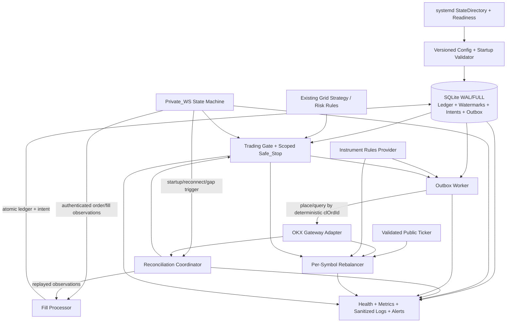
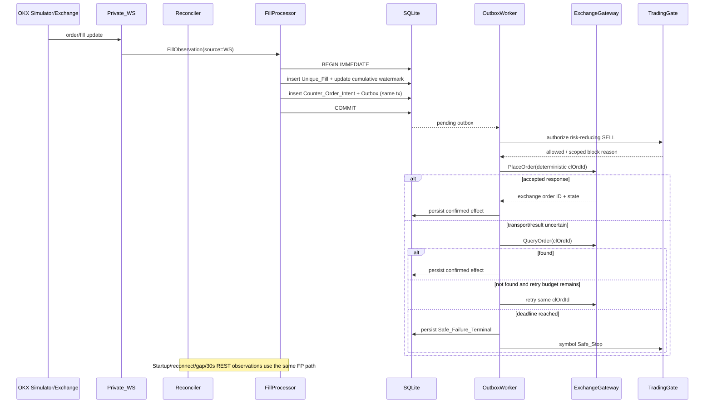
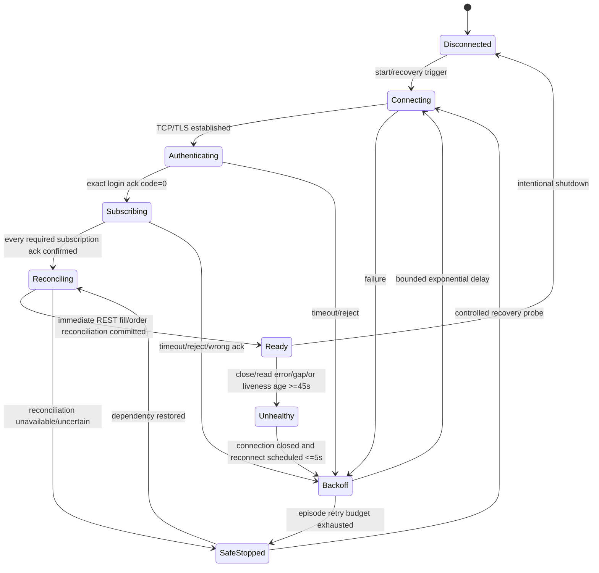

# Production Grid Stabilization Bugfix Design

## Overview

本设计修复 AWS EC2 新加坡部署中 `DOGE-USDT` 与 `WIF-USDT` 现货网格链路的可恢复性、一致性、可观测性与安全边界。核心策略是：**先持久化事实与意图，再产生交易所副作用；所有恢复均以交易所事实为权威；状态不可信时 fail closed；单交易对故障默认隔离，共享依赖故障全局停止新增风险。**

本设计只覆盖网格生产链路。均值回归策略不修改、不启用、不参与本 spec 验收；生产配置必须保持其为空或显式禁用。本 spec 在部署地点上取代旧 spec 的东京假设，所有新生成的配置、健康信息和验收证据均标记为 AWS EC2 Singapore（`ap-southeast-1`）。

当前阶段只产出设计：没有运行测试、构建或生产命令，没有连接 EC2/OKX，没有读取或记录任何凭证值，也不创建 `tasks.md`。下文将代码检查所得事实标为“静态已确认”，但只有后续在**本地未修复代码**上运行 exploration tests 得到反例后，才能把运行时根因标为已证实。

### Design Goals

1. 将 Private_WS 与 REST 对账统一为同一 `FillProcessor` 输入，使事件丢失、重复、乱序和重启恢复得到同一处理结果。
2. 通过 `Unique_Fill ledger + Counter_Order_Intent + transactional outbox + deterministic clOrdId`，以 at-least-once 处理获得 exactly-once exchange effect。
3. 在 5 秒 Counter_SELL 发起和 15 秒确认/安全失败终态内完成有界恢复。
4. 以 `StateDirectory=okx-hft-grid` 管理 `/var/lib/okx-hft-grid`，在 `ProtectSystem=strict` 下可靠写入并无损迁移 legacy SQLite 状态。
5. 把 `cash`、20/45/5 秒、30 秒对账、30 秒 rebalancer、5 秒 ticker freshness、每侧 1.5%-4% 半宽全部变成版本控制配置和启动不变量，不再依赖 `sed`。
6. 按交易对隔离状态、锁和故障；持久化、Private_WS、账户对账和组合风控等共享依赖失效时全局 Safe_Stop。
7. 自动化验收默认拒绝生产 URL、生产模式、EC2 元数据/主机和真实交易，生产启用始终要求凭证轮换证据与人工批准。

### Target Architecture



## Glossary

- **Bug_Condition (C)**: `isBugCondition(X)` 为真的生产观察；包括遗漏/重复 Counter_SELL、Private_WS 恢复超时、对账超期、rebalancer 无终态、状态目录不可用、手工热修改依赖、精度违规、跨 symbol 污染或不可信状态下继续增险。
- **Property (P)**: `expectedBehavior(result)`；Bug_Condition 下必须满足的正确、安全且可审计结果。
- **Preservation**: 对 `NOT C(X)` 的输入，在新安全门禁和交易所精度规范化之外保持既有网格语义。
- **Private_WS**: OKX 私有认证连接；当前 API 所选的 SPOT order channel 必须包含订单/fill 更新。若所选 OKX 接口另有独立 fill channel，也必须纳入 required subscriptions 并逐项确认 ack。
- **Verified_Liveness**: 最近一次有效 pong、成功解析的认证控制帧或通过校验的已订阅私有消息；仅 TCP 连接存在不算存活。
- **Unique_Fill**: 由 `symbol + exchange_order_id + stable_exchange_fill_id + cumulative_filled_quantity` 规范化并哈希得到的成交事实；原始字段也持久化以便审计。
- **Fill_Watermark**: 每订单已事务确认处理的最大累计成交量；REST 周期水位另按交易对保存 `(exchange_timestamp, stable_fill_id)`。
- **Fill_Delta**: `observed_cumulative_qty - persisted_order_cumulative_qty`。小于或等于零表示重复/乱序；若观察包含缺口且不能分解价格/成交 ID，则先对账，不臆造 delta。
- **Counter_SELL**: 覆盖合格 BUY Fill_Delta 的风险降低 POST_ONLY SELL。
- **Counter_Order_Intent**: 在发起 REST 请求前持久化的业务意图；一个合格 fill delta 最多对应一个 intent。
- **Outbox**: 与 fill ledger/intention 同库事务创建的待执行记录；支持租约、崩溃恢复和 at-least-once dispatch。
- **Exactly_Once_Effect**: 本地可重复处理，但交易所最多产生一个有效订单效果；由唯一约束、确定性 `clOrdId`、不确定结果查询和同 ID 重试共同实现。
- **Bot_Owned_Order**: `clOrdId` 使用受版本控制 namespace 且能在本地 `bot_orders` lineage 中找到的订单。仅 symbol/side/price 相似不构成所有权证明。
- **Current_Reference_Price**: 经过字段、正数和时间校验，使用时年龄不超过 5 秒的 OKX ticker `last`，同时记录 source、exchange timestamp、received timestamp 和 age。
- **Instrument_Rules**: OKX instruments 元数据适配后的 `tickSz`、`lotSz`、`minSz` 和适用 `minNotional`，全部使用十进制字符串/`decimal.Decimal`。
- **Stale_Order**: Bot_Owned、未完成，且 `ABS(orderPrice-referencePrice)/referencePrice > 0.02` 的网格单；恰好 2% 必须保留。
- **Symbol_Runtime**: 每个交易对独立的 fill/order 水位、grid state、rebalancer 锁、Safe_Stop 原因和恢复 epoch。
- **Shared_Dependency**: 两个交易对共同依赖且无法安全局部化的持久化、Private_WS、账户级对账、组合资金/风控或认证状态。
- **Risk_Increasing**: 现货 BUY、SELL fill 后的 counter BUY、初始/替代 BUY，或任何无法证明降低已知敞口的操作。
- **Risk_Reducing**: 数量不超过已知可用现货仓位、参数与状态均确认的 SELL，以及对 Bot_Owned BUY 的已确认撤单。未知终态操作不自动视为降低风险。
- **Safe_Stop**: 拒绝相应 scope 的 Risk_Increasing 操作，只允许对账、确认状态、Bot_Owned BUY 撤单及经确认的 Risk_Reducing SELL。
- **Health_State**: 对外固定序列化为 `healthy`、`degraded/reconciling` 或 `safe-stopped`，不得用进程存活替代可交易健康。
- **Reconciliation_Watermark**: 仅在一个查询窗口完整分页、结果处理事务提交成功后推进的持久化 REST 水位。
- **Safe_Failure_Terminal**: 在期限内无法确认副作用后，已持久化错误分类、未覆盖数量、Safe_Stop scope、告警结果和后续恢复条件的终态。

## Bug Details

### Bug Condition

**Formal Specification:**

```text
FUNCTION isBugCondition(X)
  INPUT: X of type ProductionGridObservation
  OUTPUT: boolean

  RETURN (X.hasEligibleUniqueBuyFill
          AND (NOT X.hasExactlyOneEligibleCounterSell
               OR X.counterSellInitiationLatency > 5 seconds
               OR (X.elapsedSinceFillObserved >= 15 seconds
                   AND NOT X.hasExchangeConfirmedCounterSellStateOrSafeFailureTerminalState)))
      OR (X.privateWSIsDisconnectedOrHalfOpen
          AND NOT X.detectedWithin45SecondsAndStartedReconnectWithin5Seconds)
      OR (X.isStartupReconnectOrGapObservation
          AND NOT X.immediateRESTFillOrderReconciliationStarted)
      OR (X.elapsedSinceLastPeriodicRESTFillOrderReconciliation >= 30 seconds
          AND NOT X.nextReconciliationStarted)
      OR (X.hasBotOwnedOpenOrderWithDeviationGreaterThanTwoPercent
          AND X.elapsedSinceEligibleRebalanceCycle >= 30 seconds
          AND NOT X.hasTerminalCancelAndReplacementOutcome)
      OR (X.serviceExpectedToRun
          AND (NOT X.productionStateDirectoryWritableOrAuthorized
               OR NOT X.serviceHealthy))
      OR X.runtimeBehaviorDependsOnManualSedMutation
      OR X.orderDoesNotMeetCurrentInstrumentPrecision
      OR X.fillOrderOrFailureStateLeaksAcrossSymbols
      OR (X.criticalStateIsUncertain AND X.systemContinuesIncreasingRisk)
END FUNCTION
```

`C(X)` 是行为条件，不把尚未运行的根因假设写进谓词。根因可在 exploration 阶段被证实或推翻，而 Bug_Condition 和外部结果要求保持稳定。

### Concrete Manifestations

1. **Duplicate partial fill**: `DOGE-USDT` BUY 的累计成交先为 `100`，相同 WS 消息被重放两次，REST 又返回同一 fill。正确结果是一个 `qty=100` 的有效 Counter_SELL intent；当前主程序接入的 `execution.GridFillHandler` 没有持久化去重，可能多次调用 `PlaceOrder`。
2. **Cumulative increment**: 同一 BUY 随后累计成交从 `100` 增至 `150`。正确结果只新增覆盖 `50` 的 intent，累计已确认及状态明确待定覆盖不得超过 `150`。
3. **Timeout after acceptance**: OKX 已接受 deterministic `clOrdId`，但 HTTP 响应丢失。系统必须先按 `clOrdId` 查询；不能直接用新 ID 重下造成重复 SELL。
4. **Half-open Private_WS**: 最后存活证据为 `t0`，远端静默。20 秒发送 heartbeat，watchdog 最迟 `t0+45s` 标记 unhealthy，并最迟 `t0+50s` 开始重连；两个 symbol 的新增风险保持暂停，直至认证、订阅确认和立即对账成功。
5. **Rebalance boundary**: 订单偏离恰好 `2.000%` 时保留；偏离 `2.001%` 且 ticker age 为 2 秒时进入流程。取消期间订单成交则先处理新增 fill，只有交易所确认旧单 cancelled 才能重挂。
6. **State migration**: `/opt/okx-hft-grid/data/hft_state.db` 存在而 `/var/lib/okx-hft-grid/hft_state.db` 不存在。启动必须备份复制、校验并原子发布 legacy 状态；不能先打开目标路径并静默创建空库。
7. **Instrument rules**: 模拟元数据给出非十进制位数可表达的任意 tick/lot（例如 `tickSz=0.0025`）。价格必须是 tick 的整数倍，不能用 symbol→小数位 switch 得到“看似四舍五入”的非法值。
8. **Symbol isolation**: WIF Counter_SELL 被拒绝只停止 WIF 新增 BUY；DOGE 在自身健康且共享账户/持久化可信时继续。若 SQLite 写失败或 Private_WS 不可信，则两者全局停止新增风险。

### Scope Boundaries

- 不改变网格算法的等差/等比含义、盈利检查、持仓/PnL 定义或组合风险上限。
- 不修改均值回归算法；生产 profile 拒绝启用它。
- 不把旧 `GridDriftEngine` 的“部分取消成功后继续”视为本 rebalancer 的安全行为；本 spec 对 Bot_Owned Stale_Order 的交易所终态要求优先。
- 不在自动化流程中执行生产凭证轮换、EC2 变更、OKX 真实订单或人工批准。

## Expected Behavior

### Expected Outcome Predicate

```text
FUNCTION expectedBehavior(result)
  INPUT: result of type ProductionGridOutcome
  OUTPUT: boolean

  RETURN result.fillCoverageIsCompleteIdempotentAndWithinDeadline
     AND result.counterSellEffectUsesDeterministicIdentity
     AND result.privateWSHeartbeat = 20 seconds
     AND result.privateWSUnhealthyDetectionLatency <= 45 seconds
     AND result.reconnectStartsWithin5SecondsOfUnhealthy
     AND result.authenticationAndRequiredSubscriptionsAreConfirmed
     AND result.startupReconnectGapReconciliationStartsImmediately
     AND result.periodicRESTReconciliationStartInterval = 30 seconds
     AND result.reconciliationWatermarkAdvancesOnlyAfterCompleteCommit
     AND result.rebalancerUsesFreshValidatedTickerLast
     AND result.everyStaleOrderHasAuditableTerminalOutcome
     AND result.productionStateIsMigratedRecoverableOrFailsClosed
     AND result.allSpotOrdersUseCashMode
     AND result.adaptiveRangeIsSymmetricPerSideWithin[0.015, 0.04]
     AND result.ordersMeetCurrentInstrumentRulesExactly
     AND result.symbolStateAndFailureScopeAreIsolated
     AND result.sharedDependencyFailureStopsAllRiskIncreasingOrders
     AND result.healthLogsMetricsAndAlertsAreSanitizedAndObservable
     AND result.automatedValidationCannotReachProduction
     AND result.productionEnablementRequiresCredentialRotationAndHumanApproval
END FUNCTION
```

### Preservation Requirements

对 `NOT isBugCondition(X)` 且新安全门禁满足的输入，固定后的 observable result 应与未修复基线相同；强制差异仅限 `cash`、metadata 合法化、durability/observability 以及 Requirements 明确要求的安全门禁。

- **3.1** 保留健康 Private_WS 下 BUY/SELL fill 的既有网格方向；SELL fill 后 counter BUY 仍走相邻下层、盈利/手续费/边界/持仓规则，但作为 Risk_Increasing 操作必须经过 TradingGate。
- **3.2** 偏离 `<=2%` 的 Bot_Owned 未完成单不因本 rebalancer 被撤换。
- **3.3** DOGE/WIF 健康时继续多币种与动态资金分配，保留单 symbol 和组合限额；精度规范化发生在分配结果之后。
- **3.4** 保留波动/价格驱动的 adaptive range，只把 clamp 改为围绕 reference 的对称每侧 `1.5%-4%`；Grid Drift 的 Position、AvgEntryPrice、RealizedPnL、TotalBuys/TotalSells 语义不变。
- **3.5** 启动清理仍在新网格前进行，但只操作经 `clOrdId + lineage` 证明为 Bot_Owned 的订单。
- **3.6** 公开行情的有效价格语义和 parser 校验保持；过期 ticker 不被提升为有效 reference。
- **3.7** 正常网格单继续使用 POST_ONLY、既有方向、盈利性和风险检查，再统一应用 `cash` 与 Instrument_Rules。
- **3.8** 订单、成交、持仓、策略、PnL、watermark 和 dedupe 状态跨目录迁移/重启保持，以交易所对账为权威，不重置合法状态。
- **3.9** symbol-scoped 故障不污染或默认停止健康 peer symbol。
- **3.10** 均值回归代码不在修改面；production profile 不加载 `MeanReversionConfigs`。
- **3.11** 继续从环境/受控 secret source 读取凭证并执行脱敏；增强字段不允许泄露 header、签名或环境值。
- **3.12** 所有自动化验证继续与真实资金、生产凭证、生产主机和生产批准动作隔离。

### Failure Scope Resolution

| Failure | Scope | Allowed while blocked | Resume condition |
|---|---|---|---|
| Counter_SELL terminal failure for one symbol | Symbol | reconcile, confirmed BUY cancellation, confirmed risk-reducing SELL | dependency fixed + symbol reconciliation success; unresolved effect may require human confirmation |
| Symbol-specific instrument metadata/rebalance terminal error | Symbol | query/cancel confirmed BUY, reconcile | fresh rules + symbol reconciliation |
| Private_WS auth/liveness/subscription uncertainty | Global | REST reconciliation and confirmed risk reduction only | auth/subscription confirmed + immediate reconciliation for each symbol |
| Persistence write/commit uncertainty | Global | no exchange mutation except independently confirmed emergency risk reduction; default is observe/query only | writable probe + DB integrity + outbox recovery + reconciliation |
| Account reconciliation/auth/portfolio allocator uncertainty | Global | query and confirmed risk reduction | shared dependency healthy + both symbols reconciled |
| Stale ticker for one symbol with public feed otherwise healthy | Symbol | no rebalance/new BUY; REST/query allowed | fresh validated ticker + no unresolved order state |

## Hypothesized Root Cause

### Statically Confirmed Implementation Facts

这些是仓库中可直接观察的事实；它们可证明实现与 Requirements 存在差距，但生产事故的具体因果链仍需 exploration tests。

| Confirmed fact | Evidence | Likely impact |
|---|---|---|
| 主程序将 Private_WS callback 接到 `internal/execution/fill_handler.go`；该路径只有一次 `PlaceOrder`，没有 ledger/outbox/REST replay，且匹配到 symbol 后把 fill size 替换为 configured `OrderSize`。另一个有 3 次 retry 的 `strategy.HandleGridFillWithRetry` 未接入此生产路径。 | `cmd/main.go`, `internal/execution/fill_handler.go`, `internal/strategy/grid_fill.go` | 1.1, 1.3-1.5；覆盖量、重复和崩溃恢复不可信 |
| Private_WS 默认 heartbeat 25 秒、timeout 30 秒，检查只在 heartbeat ticker 上发生；第一次实际 timeout 检查可能落到约 50 秒。订阅逻辑没有严格验证目标 channel ack，重连成功也没有触发交易暂停/立即对账。 | `internal/marketdata/ws_private.go` | 1.2-1.3, 1.15 |
| 启动先 start strategies/initial orders，再连接 Private_WS；Private_WS 连接失败只记录告警并让 startup 继续。 | `cmd/main.go` | 初始订单可在 fill 观察链路未 ready 时成交 |
| `Reconciler` 只定义 order/position query；默认值回退到 60 秒。`exchangeQuerierAdapter` 发出请求后返回空 slice，不解析订单/持仓，也不查询 fills 或持久化 watermark。 | `cmd/main.go`, `internal/execution/reconciler.go` | 1.3, 1.9, 1.15 |
| 单笔和批量订单都硬编码 `tdMode="cross"`；请求模型不发送 deterministic `clOrdId`，错误结果只保留拼接字符串。 | `internal/execution/api_client.go` | 1.5, 1.10, exactly-once effect 缺口 |
| `getPricePrecision` 和 fill handler 的 rounding 通过 symbol switch 硬编码；未观察到 instruments metadata provider。 | `cmd/main.go`, `internal/execution/fill_handler.go` | 1.11 |
| 当前 rebalancer 使用 30 秒 ticker 和严格 `>2%`，但不校验 ticker age，不证明订单所有权，cancel response 后不查询终态；任何一个取消成功就重新生成一批 BUY，place error/rejection 静默 `continue`。 | `cmd/main.go` | 1.6-1.7, 1.12 |
| 启动 `cancelAllPendingOrders` 对 symbol 下所有 pending orders 发 cancel，没有 bot ownership filter。 | `cmd/main.go` | 违反 3.5 的人工/其他策略订单保护 |
| 默认 persistence path 为相对 `data/hft_state.db`；SQLite 只有 orders/positions/strategy_state 表，热路径未调用 `SaveOrder/SavePosition`。 | `cmd/main.go`, `internal/persistence/store.go` | 1.4, 1.8, 3.8 |
| service 使用 `ProtectSystem=strict`，但没有 `StateDirectory`/`ReadWritePaths`；日志走 journal。 | `deploy/okx-hft-grid.service` | 1.8 的强候选 |
| 配置样例仍为 `reconcile_interval_sec: 60`、相对 persistence、包含 PEPE/mean reversion；LoadConfig 不执行全局 startup validation，Validate 函数只在测试中被调用。 | `deploy/config.example.yaml`, `internal/config/config.go`, grep usage | 1.10, 1.15, 1.16 |
| 当前 EmergencyStop 是全局布尔状态；`cancelAllOpenOrders` 用空 order ID 调用 `CancelOrder`，而 APIClient 明确拒绝空 ID。 | `internal/risk/emergency_stop.go`, `cmd/main.go`, `internal/execution/api_client.go` | scoped Safe_Stop 与可靠撤 BUY 尚未实现 |
| Alerter 仅在无 channel 或投递失败时写本地日志；成功外部投递前没有不可禁用的 journald alert event。Metrics 没有本 spec 所需健康/恢复指标或 health endpoint。 | `internal/monitor/alerter.go`, `internal/monitor/metrics.go` | 1.17 |
| 仓库不存在 `internal/marketdata/ws_private_test.go` 或 fill-handler 专用测试。 | 文件检查 | liveness/fill 闭环缺少直接回归保护 |

### Runtime Root-Cause Candidates Requiring Exploration

1. systemd `ProtectSystem=strict` 与相对 DB 路径是否正是生产 inactive/dead 的直接原因；需隔离 systemd 环境反例。
2. 生产遗漏 Counter_SELL 的主导路径是 Private_WS half-open、启动顺序、服务退出、单次下单失败还是多个因素组合。
3. OKX 在 timeout-after-accept、重复 `clOrdId`、cancel/fill race 下返回的具体状态与 `sCode` 分类；必须由模拟脚本先验证逻辑，再在获批的模拟交易环境验证适配层。
4. 现有动态资金分配与两个 symbol 并发 rebalancer 是否产生共享配置写竞态；静态代码提示风险，但需 race/调度反例。
5. legacy DB 在实际部署是否有 WAL 中已提交但未 checkpoint 的数据；迁移测试必须覆盖 `db`, `-wal`, `-shm`，不能假定只有单文件。
6. 旧订单是否都具有可证明 ownership 的 client ID；无法证明的订单必须保留并等待人工处置，不能猜测。

### Root-Cause Confirmation Rule

后续先在未修复 commit 上写并运行 Property 1 exploration tests。预期失败只确认 bug 存在，不应“修测试”。每个反例记录输入、fake time、交换所脚本、observed calls/state、缺失终态和相关 requirement。若某候选不产生反例，则将其标为 refuted 并重新假设；不得为了符合本文而强行修改观察。

## Correctness Properties

Property 1: Bug Condition - Recoverable and Idempotent Production Grid Closure

_For any_ `ProductionGridObservation X` where `isBugCondition(X)` returns true, the fixed system SHALL produce an outcome satisfying `expectedBehavior`: each eligible BUY cumulative fill delta creates at most one durable Counter_SELL intent and at most one exchange effect, starts within 5 seconds, and is exchange-confirmed or safely terminal within 15 seconds; Private_WS liveness, reconnect, authentication, subscription and immediate/30-second reconciliation meet their deadlines; every Bot_Owned Stale_Order uses a fresh ticker and reaches an audited terminal cancel/replacement outcome; state migration/config/instrument rules either validate exactly or fail closed; DOGE/WIF state and local failures remain isolated while shared uncertainty stops all risk-increasing orders; all outcomes remain observable, sanitized, production-isolated, and gated from deployment until credential rotation evidence and human approval exist.

The property includes crash points before/after ledger commit, before/after exchange acceptance, duplicate and out-of-order WS/REST observations, timeout-after-accept, cancel/fill races, persistence failure, stale ticker, invalid instrument rules, symbol interleavings, and external alert failure. No request-send acknowledgment alone satisfies this property: an exchange-confirmed order state or persisted Safe_Failure_Terminal is required.

**Validates: Requirements 2.1, 2.2, 2.3, 2.4, 2.5, 2.6, 2.7, 2.8, 2.9, 2.10, 2.11, 2.12, 2.13, 2.14, 2.15, 2.16, 2.17**

Property 2: Preservation - Healthy Grid Behavior and Non-Bug Inputs

_For any_ input where `isBugCondition(X)` returns false and all required safety gates are healthy, the fixed system SHALL preserve the original grid-observable result per symbol: healthy BUY/SELL fills retain adjacent-level direction, fee/profit/boundary/position/PnL semantics; orders at or within 2% remain; DOGE/WIF multi-symbol dynamic allocation and risk limits remain; adaptive volatility behavior changes only by the approved symmetric 1.5%-4% half-width clamp; bot-owned startup cleanup, public market-data semantics, POST_ONLY behavior and valid persisted state remain; a symbol-local failure does not change its healthy peer; mean reversion remains excluded; secret handling is not weakened; and automated validation remains fully isolated. Mandatory `cash`, exact metadata normalization, durable audit records and Safe_Stop checks are permitted refinements, not regressions.

Observation-first preservation tests SHALL first record these results on unfixed code for non-bug inputs and pass there; the same tests SHALL pass after the fix, with explicit comparators that ignore only newly added correlation IDs, timestamps, durability records and mandated configuration normalization.

**Validates: Requirements 3.1, 3.2, 3.3, 3.4, 3.5, 3.6, 3.7, 3.8, 3.9, 3.10, 3.11, 3.12**

## Fix Implementation

### Component and Data Flow

The existing Go components remain the base: `APIClient`, `OrderManager`, `Reconciler`, `GridFillHandler`, `GridState`, `RiskManagerImpl`, `SQLiteStore`, `StructuredLogger`, `MetricsServer`, `Alerter`, public `WSClient`, and `PrivateWSClient`. New orchestration is added around them rather than rewriting grid math.



### Startup Ordering and Readiness

Startup is reordered so no risk-increasing order can precede state, observation and recovery readiness:

```text
PROCEDURE productionStartup()
  load config with strict known-field decoding
  validate production location, cash/timing/range/test-mode invariants
  verify non-root/config permissions/credential presence without logging values
  verify Production_State_Directory absolute canonical path
  create-write-fsync-close-delete probe file as okxtrader
  acquire migration lock; migrate/open/validate SQLite
  initialize journald-first logger, health and metrics
  load persisted symbol state, fill watermarks, intents, outbox and Safe_Stop reasons
  construct guarded ExchangeGateway and fetch fresh Instrument_Rules for each symbol
  set GLOBAL trading gate to DEGRADED_RECONCILING
  connect/authenticate/confirm required Private_WS subscriptions
  start immediate startup reconciliation (coalesce Private_WS-ready trigger)
  recover uncertain outbox effects by deterministic clOrdId query
  reconcile and terminally clean only Bot_Owned historical orders
  connect public ticker and require fresh validated last for each enabled symbol
  IF all shared and symbol gates are satisfied THEN
      mark health healthy and notify systemd READY
      start grid/rebalancer/30-second reconciliation schedules
      place initial grid only when production trading approval gate is enabled
  ELSE
      remain degraded/reconciling or safe-stopped; do not notify tradable readiness
  END IF
END PROCEDURE
```

Production startup has a 60-second systemd readiness budget. Internal startup reconciliation uses a shorter deadline (proposed 55 seconds) so failure is surfaced before `TimeoutStartSec=60s`; exceeding it exits non-zero or remains explicitly safe-stopped according to whether control-plane health can still be served. `READY=1` means dependency and reconciliation gates are complete, not merely that the process exists.

### systemd Production_State_Directory

`deploy/okx-hft-grid.service` is designed to use:

```ini
[Unit]
StartLimitIntervalSec=60s
StartLimitBurst=3
OnFailure=okx-hft-grid-failure@%n.service

[Service]
Type=notify
User=okxtrader
Group=okxtrader
StateDirectory=okx-hft-grid
StateDirectoryMode=0750
WorkingDirectory=/opt/okx-hft-grid
ExecStartPre=/usr/bin/test -w /var/lib/okx-hft-grid
ProtectSystem=strict
ReadWritePaths=/var/lib/okx-hft-grid
UMask=0077
Restart=on-failure
RestartSec=5s
TimeoutStartSec=60s
StandardOutput=journal
StandardError=journal
```

`StateDirectory=okx-hft-grid` instructs systemd to create and own `/var/lib/okx-hft-grid` for `okxtrader`; `ReadWritePaths` makes compatibility with `ProtectSystem=strict` explicit and is verified in an isolated service test. The application still performs the stronger create/write/fsync/close probe before opening sockets. Logs remain on stdout/stderr→journald, so no writable `/opt` log path is required.

The proposed `deploy/okx-hft-grid-failure@.service` is a journald-only one-shot fallback triggered by restart-limit failure. It must not receive trading credentials. Optional external monitoring consumes the journal event; lack/failure of external delivery cannot remove the journal record. `systemctl enable` and active-state checks remain deployment actions, not automated design-time actions.

### Legacy State Migration and Empty-State Prevention

Production DB path is exactly `/var/lib/okx-hft-grid/hft_state.db`; relative production paths are rejected. Migration runs before any exchange connection.

| Target state | Legacy state | Action |
|---|---|---|
| Valid target exists | None | Open target, run schema/integrity checks and migrations transactionally |
| Target absent | Valid legacy exists | SQLite backup to target-directory temp file, validate, fsync, atomic rename, retain legacy read-only |
| Both exist with completed matching migration marker/source fingerprint | Use target | Log idempotent migration result |
| Both exist but differ or marker missing | Fail closed | Never pick one silently; journald CRITICAL and operator resolution |
| Neither exists | Default fail closed | A new installation requires version-controlled `state_bootstrap_mode: allow-new` plus explicit deployment approval and full exchange reconciliation before any BUY |
| Any source/target corruption or permission failure | Fail closed | Preserve files; no automatic destructive repair |

Atomic migration algorithm:

```text
FUNCTION migrateLegacyState(legacy, target)
  REQUIRE service is stopped except for this single startup process
  ACQUIRE exclusive file migration.lock in Production_State_Directory
  IF target exists THEN validateTargetAndMigrationMarker(); RETURN
  IF legacy missing THEN require approved allow-new bootstrap; RETURN

  OPEN legacy through SQLite read-only/backup API so committed WAL content is included
  CREATE target.tmp.<random> inside Production_State_Directory with mode 0600
  BACKUP complete SQLite image into temp
  RUN quick/integrity check, schema-version check and logical row-count checks
  RECORD migration source fingerprint, timestamp and schema version in temp transaction
  FSYNC temp database and required SQLite files
  CLOSE source and temp cleanly
  ATOMIC_RENAME target.tmp.<random> -> hft_state.db (same target filesystem)
  FSYNC Production_State_Directory
  REOPEN target; repeat integrity and required-table checks
  KEEP legacy untouched as rollback evidence
  RELEASE migration.lock
END FUNCTION
```

Raw copying only `hft_state.db` is prohibited because committed data may reside in `-wal`. Publication uses rename within `/var/lib/okx-hft-grid`, so it is atomic even when `/opt` and `/var` are different filesystems. Schema changes are additive where possible. Runtime SQLite uses WAL and `synchronous=FULL` for fill ledger, watermark, intent, outbox and Safe_Stop transitions. Any critical write/commit failure is a shared dependency failure and triggers global Safe_Stop.

### Version-Controlled Configuration and Startup Validation

`SystemConfig` gains explicit, strictly decoded fields. Approved production values are not mutable defaults hidden in code or deployment `sed`:

| Setting | Required production value/rule |
|---|---|
| `deployment.location` | `aws-ap-southeast-1-singapore` |
| `execution.td_mode` | exactly `cash` |
| `private_ws.heartbeat_interval` | exactly `20s` |
| `private_ws.liveness_timeout` | `45s`; values allowing later detection rejected |
| `private_ws.reconnect_start_deadline` | at most `5s` |
| `reconciliation.interval` | exactly `30s`; `60s` rejected |
| `rebalancer.interval` | `30s`, scheduling jitter budget `<=5s` |
| `ticker.max_age` | `5s` |
| `adaptive_range.min_half_width` | `0.015` |
| `adaptive_range.max_half_width` | `0.04` |
| `adaptive_range.symmetric` | `true`; lower=`p*(1-r)`, upper=`p*(1+r)` |
| `persistence_path` | `/var/lib/okx-hft-grid/hft_state.db` |
| `symbols` | production scope exactly DOGE/WIF unless a later approved spec changes it |
| `mean_reversion_configs` | empty in this production profile |
| `execution_mode` | `production`, `simulated`, `replay`, or `unit`; production requires deployment gates |
| `trading_enabled` | false in staged/reconcile-only deployment; true only in separately approved versioned config |

Validation runs before credentials are used for network I/O. YAML unknown fields are rejected. Effective config logging uses an allowlist of non-secret fields; URL output is reduced to scheme/host and never includes query/userinfo. Invalid `cross`, 86400-second liveness, asymmetric or total-width interpretation, stale 60-second reconcile, relative state path, production mean reversion, or production mode without gate evidence prevents order submission.

### Private_WS Liveness and Recovery State Machine



Design rules:

- Heartbeat send interval is 20 seconds. A separate 1-second watchdog checks liveness age so detection is not quantized to 40/60 seconds.
- Verified_Liveness updates only from valid pong/authenticated protocol evidence; arbitrary bytes or socket-open state do not refresh it.
- Login and subscription responses must match expected event, code, channel and instrument type. A data push is not accepted as subscription ack.
- Any disconnect, reconnect epoch or detected message/cumulative gap closes the global Risk_Increasing gate, because Private_WS is shared.
- Initial reconnect delay is 1 second, exponential and bounded (proposed 1, 2, 4, 8… capped at 30 seconds, maximum 10 attempts per recovery episode). The first attempt therefore starts within 5 seconds. Exhaustion remains SafeStopped and raises CRITICAL; slow controlled probes may continue without reopening trading.
- On successful auth/subscription, state is `Reconciling`, not `Ready`. Reconciliation is triggered immediately and must commit before new BUY resumes.
- State-change callbacks publish reason code, epoch, last liveness, reconnect count and subscription set to HealthRegistry without exposing credentials.

### REST Fill/Order Reconciliation and Watermarks

`ReconciliationCoordinator` replaces the current order/position-only loop while reusing `OrderManager` and `APIClient` through a richer gateway.

Triggers:

- immediate: startup, Private_WS reconnect/subscription recovery, detected gap, outbox uncertainty;
- periodic: fixed-rate 30 seconds measured from the prior cycle start;
- manual: health-safe diagnostic trigger, not a production approval action.

Per-symbol cycles do not overlap. If a trigger arrives while running, a single `pending=true` follow-up is coalesced and starts immediately after completion. A cycle running into the next 30-second due point records overrun and keeps the symbol/global gate degraded according to failure classification; it is never silently skipped.

```text
FUNCTION reconcile(symbol, reason)
  ACQUIRE Symbol_Runtime[symbol].reconcileLock
  watermark := load committed Reconciliation_Watermark(symbol)
  windowStart := watermark.timestamp - boundedOverlap
  QUERY all pages of bot-owned fills and relevant pending/history orders
  FOR each returned fill ordered by (exchange_time, stable_fill_id) DO
      FillProcessor.observe(source=REST, observation)
  END FOR
  QUERY uncertain intents/orders by exchange ID or deterministic clOrdId
  APPLY exchange-authoritative order states and discovered cancel/fill races
  VERIFY pages complete, no unresolved cursor, and all DB transactions committed
  ATOMICALLY persist new watermark and cycle summary
  EMIT query window, pages, checked count, compensated fills, duplicates, diffs, terminal result
  RELEASE lock
END FUNCTION
```

The overlap window handles equal timestamps and late ordering; idempotency makes overlap safe. Watermark never advances on partial page, transport/auth failure, parser error or DB failure. A missing watermark does not silently mean “now”: migration supplies it, or approved bootstrap queries a conservative complete history/window and bot order lineage before trading. Both WS and REST observations call the same `FillProcessor`.

### Unique_Fill Ledger, Cumulative Delta, Intent and Outbox

Proposed additive SQLite tables (names may be adjusted without changing semantics):

```text
fill_ledger(
  fill_key PRIMARY KEY,
  symbol, exchange_order_id, exchange_fill_id,
  side, cumulative_qty, delta_qty, fill_price,
  source, exchange_ts, observed_at,
  eligibility, ineligible_reason,
  UNIQUE(symbol, exchange_order_id, exchange_fill_id, cumulative_qty)
)

order_fill_watermarks(
  symbol, exchange_order_id, processed_cumulative_qty,
  PRIMARY KEY(symbol, exchange_order_id)
)

counter_order_intents(
  intent_id PRIMARY KEY,
  fill_key UNIQUE,
  symbol, side, price, quantity,
  deterministic_client_order_id UNIQUE,
  observed_at, initiation_deadline, terminal_deadline,
  status, attempts, exchange_order_id,
  final_error_class, final_scode, final_smsg
)

order_outbox(
  outbox_id PRIMARY KEY,
  intent_id UNIQUE,
  status, lease_owner, lease_until,
  next_attempt_at, attempt_count, last_error_class
)

reconciliation_watermarks(
  symbol, stream, exchange_ts, stable_id, completed_at,
  PRIMARY KEY(symbol, stream)
)

bot_orders(
  client_order_id PRIMARY KEY,
  exchange_order_id, symbol, strategy_id, purpose,
  parent_order_id, intent_id, state, cumulative_fill_qty
)

safe_stop_state(
  scope, symbol, reason_code, active, since, recovery_epoch,
  PRIMARY KEY(scope, symbol, reason_code)
)

rebalance_outcomes(
  run_id, symbol, old_client_order_id, old_exchange_order_id,
  reference_price, reference_age_ms, deviation,
  terminal_outcome, replacement_client_order_id, error_class,
  PRIMARY KEY(run_id, old_exchange_order_id)
)
```

`fill_key` uses a canonical delimiter-safe encoding followed by a versioned hash. Original exchange IDs are retained for audit. If a WS update lacks a stable fill ID or cumulative fields needed to prove delta, it is not guessed; it triggers REST reconciliation and keeps new BUY paused for that scope.

Atomic observation:

```text
FUNCTION observeFill(O)
  BEGIN IMMEDIATE TRANSACTION
  validate O.symbol belongs to O.order and Bot_Owned lineage
  previous := order_fill_watermarks[O.symbol, O.order]

  IF O.cumulative_qty <= previous THEN
      record duplicate/out-of-order metric; COMMIT; RETURN DUPLICATE
  END IF

  IF O indicates an unresolvable gap THEN
      record pending-reconciliation observation; COMMIT
      trigger immediate reconciliation; RETURN GAP
  END IF

  delta := O.cumulative_qty - previous
  insert fill_ledger ON CONFLICT DO NOTHING
  IF insert conflicted THEN COMMIT; RETURN DUPLICATE

  apply existing GridState position/PnL semantics once for delta
  update order_fill_watermarks to O.cumulative_qty

  IF BUY delta is eligible THEN
      derive exact normalized SELL using current grid/profit/risk rules and Instrument_Rules
      create deterministic intent_id and clOrdId
      insert counter_order_intents and order_outbox in same transaction
  ELSE
      persist reason and activate symbol safety gate appropriate to uncovered quantity
  END IF
  COMMIT
  signal outbox worker
END FUNCTION
```

For SELL fills, the same ledger prevents duplicate GridState/PnL updates; the existing counter BUY intent is created only when the symbol is Healthy and risk checks approve it. Counter BUY is blocked during Safe_Stop because it increases risk.

### Exactly-Once Effect Through At-Least-Once Processing

`deterministic_client_order_id = Encode(version, purpose, symbol, truncated hash(intent_id), checksum)` and is constrained by the adapter to OKX's current length/character rules. The same intent always uses the same `clOrdId`.

| Crash point | Recovery behavior |
|---|---|
| Before ledger transaction commit | No durable fact/effect; WS replay or REST reconciliation re-observes it |
| After fill/intent/outbox commit, before send | Lease expires or startup scan dispatches pending outbox |
| During request before exchange acceptance | Query by `clOrdId`; if absent and budget remains, resend same ID |
| After exchange acceptance, before response/local commit | Query returns the accepted order; persist it, never create a new ID |
| After confirmed effect commit | Duplicate observations hit unique constraints and produce no second effect |
| Worker dies while leased | Lease expiry allows another worker; deterministic ID preserves effect idempotency |

At all times:

```text
confirmed_counter_sell_qty(order)
+ state_known_pending_counter_sell_qty(order)
<= cumulative_eligible_buy_fill_qty(order)
```

After reconciliation, if no Safe_Failure_Terminal remains, equality must hold. An uncovered quantity is never hidden: it is persisted, exported and symbol Safe-Stopped.

### Counter_SELL SLO and Error Classification

- `observed_at` is captured at first durable WS/REST observation; duplicate sources do not reset it.
- Ledger+intent transaction and first dispatch are prioritized so request initiation occurs by `observed_at+5s`.
- All network calls receive a context bounded by remaining time; the current 30-second generic HTTP timeout cannot govern Counter_SELL.
- Proposed bounded schedule within the 15-second budget: immediate attempt, uncertainty query, then at most two same-ID retries with short bounded backoff. Exact per-call timeout is tested with fake time and must leave time for a final query and Safe_Failure_Terminal commit.
- At `observed_at+15s`, status must be exchange-confirmed `accepted/open/filled` or locally persisted safe failure with symbol Safe_Stop and immediate journald CRITICAL. External alert delivery may continue asynchronously, but the alert event is recorded immediately and no later than 30 seconds.

| Classification | Examples | Action |
|---|---|---|
| `confirmed-success` | accepted/open/filled response or query | Persist order/effect; no retry |
| `uncertain-transport` | timeout/reset after request may have left process | Query by clOrdId before any retry |
| `retryable-transient` | bounded 429/5xx/service busy | Backoff within deadline; same clOrdId |
| `stale-instrument-rule` | precision/min rule rejection plausibly due metadata change | Refresh metadata once, re-normalize only if intent coverage/profit remains valid; bounded retry |
| `definitive-business-reject` | invalid parameter after refresh, insufficient available asset, POST_ONLY cannot be safely repriced | No identical unbounded retry; persist rejection and symbol Safe_Stop for Counter_SELL |
| `auth/permission/account-uncertain` | authentication/permission/account query failure | Shared dependency global Safe_Stop |
| `unknown-terminal` | cancel/place cannot be proven present or absent by deadline | No replacement/new risk; safe terminal and alert |

Logs store `sCode/sMsg` or equivalent after sanitization, operation, symbol, side, exact decimal price/quantity, client/exchange IDs, attempt and final class. No header, signature or credential field is accepted into the log event schema.

### Instrument Metadata and Decimal Normalization

`InstrumentRulesProvider` fetches rules before any initial/recovered placement and refreshes periodically (proposed every 5 minutes, hard TTL 15 minutes) and once on relevant rejection. Expired rules block new orders. The adapter must verify the exact current OKX fields during implementation; `minNotional` is enforced when the authoritative instrument/account rule supplies it and is never guessed from a symbol switch.

```text
FUNCTION normalizeOrder(order, rules)
  REQUIRE rules.symbol = order.symbol AND rules.age <= TTL
  REQUIRE all decimals are finite positive base-10 values

  IF order.side = BUY THEN price := floorToMultiple(order.price, rules.tickSz)
  ELSE price := ceilToMultiple(order.price, rules.tickSz)
  quantity := floorToMultiple(order.quantity, rules.lotSz)

  ASSERT price MOD rules.tickSz = 0
  ASSERT quantity MOD rules.lotSz = 0
  ASSERT quantity >= rules.minSz
  ASSERT no applicable minNotional OR price*quantity >= rules.minNotional
  ASSERT POST_ONLY/profit/risk checks still hold after normalization
  RETURN normalized order OR explicit no-send reason
END FUNCTION
```

All arithmetic uses `shopspring/decimal`; no `float64` conversion determines validity. Initial grid, Counter_SELL/counter BUY and rebalancer replacement all pass through the same normalizer. A no-send result for uncovered BUY fill enters the Counter_SELL safe-failure path.

### Rebalancer Design

The inline `cmd/main.go` goroutine moves into a testable `Rebalancer` component. Each `Symbol_Runtime` has a non-overlap lock shared with Grid Drift/order-mutation planning, while DOGE and WIF may run concurrently when shared dependencies are healthy.

Cycle:

1. Schedule every 30 seconds using fixed-rate timestamps; record actual jitter and mark unhealthy if it exceeds 5 seconds.
2. Acquire symbol lock; if prior cycle still runs, coalesce one follow-up and expose overrun—never overlap.
3. Obtain ticker `last` with source/exchange/receive timestamps. Reject missing, non-positive, malformed or age `>5s`; mark cycle `skipped/unhealthy` and place/cancel nothing based on that price.
4. Query pending orders and filter by `clOrdId` namespace plus persisted `bot_orders` lineage. Preserve unknown/manual/other-strategy orders.
5. Compute exact decimal deviation. `<=0.02` yields `kept-by-rule`; only `>0.02` enters stale workflow.
6. Query each stale order before cancel. If already filled, feed missing fill delta through `FillProcessor` and end `filled`. If already cancelled, mark `already-cancelled` and evaluate a replacement only from current desired occupancy.
7. For open/partial order, first process current cumulative fill, send cancel, then poll/query terminal state within the cycle deadline. A successful cancel API response is not terminal proof.
8. If another fill occurs during cancel, process its delta before any replacement. If final state is unknown, create no replacement, mark `failed-safe`, symbol Safe_Stop and alert.
9. Only after exchange-confirmed cancel, recompute desired one-for-one grid occupancy using fresh reference, dynamic allocation snapshot, existing risk/profit rules and current Instrument_Rules. Use a durable replacement intent/deterministic clOrdId; do not regenerate an uncontrolled full BUY batch.
10. Persist exactly one outcome by the next cycle: `replaced`, `filled`, `already-cancelled`, `kept-by-rule` or `failed-safe`. Rejection/error is never a silent `continue`.

Startup cleanup uses the same ownership, query, cancel-confirm and race handling before any new grid. This preserves 3.5 while removing the current broad cancellation behavior.

### Symbol Isolation and Scoped Safe_Stop

```text
SymbolRuntime {
  symbol
  gridState
  fillWatermarks
  reconciliationWatermark
  rebalancerMutex
  mutationEpoch
  symbolHealth
  symbolSafeStopReasons
}

SharedRuntime {
  persistenceHealth
  privateWSHealth
  accountReconciliationHealth
  portfolioRiskHealth
  allocationSnapshot
  globalSafeStopReasons
}
```

Database primary/unique keys include `symbol` wherever exchange IDs are not globally guaranteed; every handler checks `observation.symbol == order.symbol == intent.symbol`. A WIF callback cannot resolve a DOGE lineage row. Metrics/logs include bounded symbol labels. Property tests generate interleavings and assert no cross-symbol order, watermark, lock, allocation or failure mutation.

`TradingGate.Authorize(symbol, operation)` combines existing `RiskManager` with scoped health:

- Healthy: existing risk checks decide.
- Symbol Safe_Stop: deny all symbol Risk_Increasing operations; allow confirmed risk reduction.
- Global Safe_Stop: deny Risk_Increasing operations for both symbols.
- Recovery: clear a reason only after dependency health and required reconciliation epoch succeed. Unknown exchange effect or migration conflict requires human confirmation; automatic recovery is prohibited when safety cannot be proven.

The existing global `EmergencyStopManager` remains for portfolio/PnL emergency stop. A new scoped coordinator composes with it rather than weakening it.

### Health, Structured Logs, Metrics and Alerts

`HealthRegistry` aggregates dependencies and symbol states. The existing metrics HTTP server is extended with a localhost machine endpoint (for example `/healthz`) and a CLI health check used by operations. Production monitoring bind failure is a startup/safety failure, not silently non-fatal.

Health snapshot includes:

```json
{
  "state": "healthy | degraded/reconciling | safe-stopped",
  "location": "aws-ap-southeast-1-singapore",
  "service_expected": true,
  "state_directory_writable": true,
  "private_ws": {"state":"ready", "last_liveness_age_ms":0, "reconnects":0, "subscriptions_confirmed":true},
  "reconciliation": {"last_success": "...", "lag_ms":0},
  "symbols": {
    "DOGE-USDT": {"state":"healthy", "safe_stop_reasons":[]},
    "WIF-USDT": {"state":"healthy", "safe_stop_reasons":[]}
  }
}
```

No credential-derived value appears. Health response order IDs are counts/correlation hashes, not full payload dumps.

Required bounded-label metrics include:

- service expected/up, health state, state-directory writable;
- Private_WS state, last-liveness age, reconnect total, subscription-ready;
- reconciliation last success, lag from 30-second schedule, duration/outcome, checked/diff/compensated counts;
- duplicate fills suppressed, fill gaps, outbox backlog/lease recovery;
- Counter_SELL initiation latency and outcomes (`confirmed`, `rejected`, `unconfirmed`, `safe_failed`);
- rebalancer last run/jitter, reference source/age, stale count, cancel/replacement terminal outcomes;
- Safe_Stop active by bounded scope/reason code;
- alert attempts and delivery outcomes.

Order/fill IDs are not Prometheus labels. Structured logs use event/correlation IDs and include required client/exchange order references in log fields after sanitizer. `StructuredLogger` sanitizes keys and values and rejects known sensitive field names (`authorization`, access key, secret, passphrase, signature, environment dump).

Alert flow is journald-first:

1. synchronously emit sanitized structured `alert_raised` to stdout/journald;
2. enqueue optional Telegram/Discord/other channel delivery;
3. bounded retry externally;
4. emit `alert_delivery` success/failure to journald for every channel.

Thus no channels configured, external outage or success can suppress the mandatory journal evidence.

### Interface Drafts

```go
type ExchangeGateway interface {
    PlaceOrder(ctx context.Context, req NormalizedOrderRequest) (OrderEffect, error)
    CancelOrder(ctx context.Context, ref OrderRef) (CancelAttempt, error)
    QueryOrder(ctx context.Context, ref OrderRef) (ExchangeOrder, error)
    ListPendingOrders(ctx context.Context, symbol string) ([]ExchangeOrder, error)
    ListOrderHistory(ctx context.Context, symbol string, window QueryWindow) (OrderPage, error)
    ListFills(ctx context.Context, symbol string, cursor FillCursor) (FillPage, error)
    GetTicker(ctx context.Context, symbol string) (TickerObservation, error)
    GetInstrumentRules(ctx context.Context, symbol string) (InstrumentRules, error)
}

type FillProcessor interface {
    Observe(ctx context.Context, observation FillObservation) (FillProcessResult, error)
}

type ReconciliationCoordinator interface {
    Trigger(scope ReconcileScope, reason ReconcileReason)
    ReconcileNow(ctx context.Context, symbol string, reason ReconcileReason) (ReconcileResult, error)
}

type TradingGate interface {
    Authorize(symbol string, class OperationRiskClass) GateDecision
    EnterSymbolSafeStop(symbol string, reason ReasonCode)
    EnterGlobalSafeStop(reason ReasonCode)
    MarkReconciled(symbol string, epoch uint64)
}

type InstrumentRulesProvider interface {
    Current(ctx context.Context, symbol string) (InstrumentRules, error)
    Refresh(ctx context.Context, symbol string) (InstrumentRules, error)
}

type DurableStore interface {
    WithImmediateTx(ctx context.Context, fn func(TxStore) error) error
    ClaimOutbox(ctx context.Context, workerID string, now time.Time) (OutboxRecord, error)
    LoadRecoveryState(ctx context.Context) (RecoveryState, error)
}
```

`APIClient.DoRequest` becomes context-aware and returns structured OKX code fields instead of forcing callers to parse error strings. Existing `OrderExecutionEngine` can be adapted behind `ExchangeGateway`; grid strategy remains unaware of HTTP details.

### Concurrency and Atomicity

- **SQLite single source of truth**: ledger/watermark/intent/outbox creation is one `BEGIN IMMEDIATE` transaction. No network I/O occurs while holding it.
- **Outbox leases**: atomic compare/update claims one row; lease timeout permits recovery. Unique intent/client IDs prevent duplicate effects.
- **Per-symbol actor/lock**: serializes reconciliation apply, rebalancer planning and grid mutation for one symbol. Different symbols can progress independently.
- **Shared dependency locks**: allocation snapshot and global health transition use short locks; REST calls happen outside locks and validate epoch before commit.
- **Epoch check**: rebalancer captures symbol mutation epoch before queries and revalidates before replacement; a fill/reconcile change forces re-plan.
- **Lock order**: global health → symbol runtime → DB transaction; never acquire global/symbol locks from inside a DB callback that may call network/alerts.
- **No mutable shared config**: adaptive ranges and dynamic sizes produce immutable per-cycle snapshots; current mutation of `app.cfg.GridConfigs` is replaced by runtime state.
- **Clock injection**: SLO/state-machine code receives monotonic-capable `Clock`; persisted wall timestamps support restart audit, while duration tests avoid sleep.

### Error Handling Matrix

| Condition | Detection | State mutation | Trading response | Evidence |
|---|---|---|---|---|
| State directory probe/migration fails | filesystem/SQLite validation | no trading state opened | startup fail/global Safe_Stop | journald CRITICAL + migration stage |
| Critical DB commit fails at runtime | transaction error | do not claim success | global Safe_Stop | DB operation/error class, no secrets |
| Private_WS half-open/auth/sub failure | watchdog/strict ack | WS state unhealthy | global risk-increasing pause, reconnect | liveness age, epoch, attempts |
| REST reconcile partial/fails | page/cursor/commit error | watermark unchanged | scoped or global Safe_Stop by classifier | window/pages/counts/result |
| Duplicate/out-of-order fill | unique key/cumulative comparison | no second intent/PnL update | continue | duplicate counter |
| Fill gap | cumulative discontinuity/missing stable ID | pending reconciliation marker | pause new BUY; immediate reconcile | gap fields/correlation |
| Counter_SELL uncertain | transport result + query | intent remains uncertain | same-ID query/retry, then symbol Safe_Stop | attempts, clOrdId, final class |
| Instrument rule invalid/stale | TTL/normalizer/rejection | no order send | symbol block; refresh once | rule version and no-send reason |
| Rebalance cancel/fill race | pre/post cancel query cumulative change | process fill first | no replacement until cancel terminal | one stale-order outcome |
| Ticker stale/invalid | age/value validation | no grid mutation | skip cycle, symbol degraded | source/age/skip reason |
| External alert fails | channel result | journal event remains | no change to safety state | delivery outcome/retries |
| Symbol-only failure | reason classification | symbol reason active | peer continues if shared healthy | per-symbol health |
| Shared uncertainty | shared health registry | global reason active | both deny new risk | global health/alert |

### Deployment and Rollback Design (Not Execution)

Deployment is a gated runbook, never an automated side effect of tests:

1. **Automated acceptance gate**: local unit/PBT/replay/simulator/isolation suites pass; artifact and config are immutable and checksummed. No production URL, EC2 or credential is contacted.
2. **Security gate—human evidence**: revoke all exposed old credentials; create new spot-trade-only credentials with withdrawal/transfer disabled and approved Singapore EC2 IP allowlist. Record only evidence IDs/status, never values.
3. **Artifact/config review gate**: review `cash`, 20/45/5, 30 seconds, 1.5%-4% symmetric half-width, state path, DOGE/WIF scope, Singapore label, mean reversion disabled and `trading_enabled=false` staged config.
4. **Manual deployment approval**: a named human approves installation. Only then may operations stop the service, back up state, install binary/config/units and daemon-reload.
5. **Reconcile-only start**: service creates/migrates state, authenticates, subscribes, reconciles and exposes health while new risk remains disabled.
6. **Evidence review**: verify state migration marker, outbox recovery, no unresolved fills/orders, machine health, journald fallback and external alert status.
7. **Separate production-trading approval**: deploy an approved version-controlled config with `trading_enabled=true`; no `sed` or implicit test transition is allowed.
8. **Post-enable observation**: verify both symbols, first reconciliation cycles, fill→intent correlation and rebalancer outcomes. Any uncertainty activates Safe_Stop.

Rollback rules:

- Enter global Safe_Stop and stop new risk before replacing artifacts.
- Stop the service cleanly; preserve current DB, WAL and journal evidence. Never restore a stale DB over newer exchange effects without reconciliation.
- Before the new schema/outbox has produced effects, previous binary/config/unit may be restored with the pre-migration backup after integrity validation.
- After new intents/effects exist, rollback is allowed only to an artifact declared schema/outbox-compatible. The old unfixed binary must not resume production trading; prefer roll-forward while remaining reconcile-only.
- Any rollback starts with `trading_enabled=false`, deterministic effect recovery and immediate exchange reconciliation. Human approval is required again to resume.
- Credential rotation is not rolled back. Old/revoked credentials and Tokyo IP assumptions are never restored.

### Expected File Impact

No files in this table are modified during this Design phase. “New” means proposed implementation/test files that do not currently exist.

| Path | Status | Expected responsibility |
|---|---|---|
| `cmd/main.go` | existing, modify | reorder startup; wire health/gates/reconciliation; remove inline rebalancer and symbol precision switch; keep composition only |
| `internal/config/config.go` | existing, modify | strict production fields and startup validation |
| `internal/config/security.go`, `credentials.go`, `sanitize.go` | existing, extend narrowly | environment/gate checks and stronger sensitive-field handling; never log values |
| `internal/execution/api_client.go`, `engine.go` | existing, modify | `cash`, context deadlines, clOrdId, structured results, query/fill/instrument APIs |
| `internal/execution/fill_handler.go` | existing, refactor | adapt Private_WS observations into durable FillProcessor; remove direct one-shot placement |
| `internal/execution/reconciler.go` | existing, extend/refactor | fill+order pagination, immediate triggers, 30-second schedule, watermark summaries |
| `internal/execution/order_manager.go` | existing, extend | client/exchange ID lookup and exchange-authoritative terminal updates |
| `internal/execution/fill_processor.go` | new | ledger/cumulative delta/grid-state transaction and intent creation |
| `internal/execution/outbox.go` | new | leases, deterministic dispatch/query/recovery and 5/15 SLO |
| `internal/execution/instrument_rules.go` | new | instruments metadata cache and decimal normalizer |
| `internal/execution/rebalancer.go` | new | fresh ticker, ownership filter, cancel/fill race, terminal outcomes |
| `internal/marketdata/ws_private.go` | existing, modify | explicit liveness state machine, strict ack, callbacks and fake clock/dialer |
| `internal/persistence/store.go` | existing, modify | transaction API, additive tables, FULL durability for critical transitions |
| `internal/persistence/migration.go` | new | legacy SQLite backup validation and atomic publication |
| `internal/risk/emergency_stop.go` | existing, preserve/compose | retain portfolio global emergency semantics |
| `internal/risk/safe_stop.go` | new | symbol/global reasons, operation classification and recovery gates |
| `internal/monitor/logger.go`, `metrics.go`, `alerter.go` | existing, modify | journald-first alerts, health endpoint and required metrics |
| `internal/monitor/health.go` | new | aggregate machine-readable health states |
| `pkg/models/events.go`, `order.go` | existing, extend | stable fill/cumulative fields, client order ID and structured effects |
| `pkg/models/recovery.go`, `pkg/models/instrument.go` | new | durable recovery and instrument domain records |
| `deploy/okx-hft-grid.service` | existing, modify | StateDirectory, notify readiness, restart limits and OnFailure |
| `deploy/okx-hft-grid-failure@.service` | new | credential-free journald restart-limit alert |
| `deploy/config.example.yaml`, `deploy/env.example`, `deploy/README.md` | existing, modify | versioned values, no secrets, Singapore deployment and gated runbook |
| `internal/strategy/grid_fill.go`, `grid_orders.go`, Grid Drift files | existing, minimal/no semantic change | reuse adjacent-level/profit/PnL logic; coordinate through shared symbol lock |
| mean-reversion source files | existing, no change | explicitly out of scope |

## Testing Strategy

### Validation Approach

Testing follows bugfix observation-first order:

1. **Explore** on local unfixed code: write Property 1 tests first and run against simulators/replay. Expected result is failure with documented counterexamples.
2. **Preserve** on local unfixed code: observe non-bug behavior, write Property 2 tests, and require they pass before implementation.
3. **Implement** only after counterexamples identify actual causes.
4. **Validate** by rerunning the same exploration tests (now pass), the same preservation tests (still pass), then integration/isolation suites.

This document does not run any of those tests. All future default test transports are loopback-only and all state paths use `t.TempDir()` or an isolated Linux image.

### Exploratory Bug Condition Checking

Property 1 is intentionally scoped into deterministic subcases while remaining one traceable bug-condition property.

| ID | Unfixed-code scenario | Expected pre-fix counterexample | Requirements |
|---|---|---|---|
| EXP-01 | duplicate WS + REST replay of one BUY fill | multiple direct `PlaceOrder` calls/no persistent dedupe | 1.1, 1.4 → 2.1, 2.4 |
| EXP-02 | cumulative 100→150 partial fill | configured OrderSize or full cumulative used instead of delta 50 | 1.4 → 2.4 |
| EXP-03 | crash after simulated acceptance, before local record | replay can create second order/no deterministic recovery | 1.3-1.5 → 2.4-2.5 |
| EXP-04 | silent WS peer with fake time | not unhealthy/reconnecting within 45+5; no reconciliation gate | 1.2-1.3 → 2.2-2.3 |
| EXP-05 | startup/reconnect REST contains missed fill | no REST fill query/common pipeline | 1.3 → 2.3 |
| EXP-06 | scheduler advances 30 seconds | current default/adapter fails complete fill+order reconciliation | 1.3 → 2.3 |
| EXP-07 | capture single/batch order JSON | `tdMode=cross`, no deterministic clOrdId | 1.10 → 2.10 |
| EXP-08 | arbitrary simulator tick/lot/min rules | symbol decimal switch emits invalid order | 1.11 → 2.11 |
| EXP-09 | stale owned order with cancel/fill race | replacement may occur without terminal cancel/fill processing | 1.6-1.7 → 2.6-2.7 |
| EXP-10 | mixed owned/manual pending orders | startup attempts to cancel unowned order | 1.6 → 3.5 |
| EXP-11 | isolated `ProtectSystem=strict` service + legacy WAL DB | state path fails or empty target is created/no verified migration | 1.8-1.9 → 2.8-2.9 |
| EXP-12 | interleaved DOGE/WIF fill/failure/rebalance | lack of provable isolation/scoped failure | 1.12, 1.15 → 2.12, 2.15 |
| EXP-13 | force alert channel success/failure | no unconditional journald alert event/full required signals | 1.17 → 2.17 |
| EXP-14 | attempt production URL/EC2 metadata in test mode | no centralized fail-before-I/O guard | 1.14 → 2.14 |

Each failing run records the minimal rapid counterexample or deterministic script. If a test unexpectedly passes on unfixed code, mark it as an unexpected pass and inspect whether the bug was already fixed or the reproduction is invalid; do not proceed by weakening assertions.

### Preservation Checking

Observation-first means these are run and recorded on unfixed code before implementation:

| ID | Observation baseline | Comparator after fix | Requirements |
|---|---|---|---|
| PRE-01 | one healthy BUY/SELL fill with fill qty equal configured qty | adjacent counter side/level, profit/PnL/position equal; ignore durable IDs | 3.1 |
| PRE-02 | generated deviations from 0 through exactly 2% | no rebalancer cancel | 3.2 |
| PRE-03 | healthy DOGE/WIF dynamic balance allocation | equivalent allocation/risk totals after lot normalization | 3.3 |
| PRE-04 | adaptive volatility inputs and GridState before/after drift | same directional/volatility semantics; only clamp differs; PnL state equal | 3.4 |
| PRE-05 | Bot_Owned startup cleanup | owned orders still clean before new grid; unowned protected | 3.5 |
| PRE-06 | valid public ticker replay | identical parsed prices, sequence and dispatch; stale remains rejected | 3.6 |
| PRE-07 | grid order generation | POST_ONLY, direction, profitability and risk decisions equal before normalization | 3.7 |
| PRE-08 | orders/positions/strategy/PnL round-trip | logical state equal after migration/restart/reconcile | 3.8 |
| PRE-09 | one symbol local failure with healthy shared dependencies | peer symbol outputs equal baseline | 3.9 |
| PRE-10 | production profile load and source diff | no mean-reversion activation or source modification | 3.10 |
| PRE-11 | secret-shaped values in every observability path | no raw value; controlled credential loading unchanged | 3.11 |
| PRE-12 | every automated test entry point | production/network/approval effects remain impossible | 3.12 |

### Unit Tests

- Config table tests for every approved exact value and every invalid `cross`, 60/86400 seconds, asymmetric/total-width interpretation, relative path, unknown YAML field and production mean-reversion entry.
- Private_WS state transition/strict ack/watchdog tests with fake clock and local WebSocket server.
- Fill key canonicalization, cumulative delta, eligibility, unique constraints and transaction rollback tests.
- Outbox lease, deterministic clOrdId, deadline and error-classifier tests.
- Instrument multiple/side-aware rounding/minimum tests using decimal strings, including `0.0025`-style ticks.
- Reconciler pagination, overlap, watermark no-advance-on-failure and trigger coalescing tests.
- Rebalancer strict 2% boundary, ownership, fresh ticker and terminal outcome tests.
- Safe_Stop operation classification/scope/recovery tests.
- Migration decision matrix, WAL-aware backup, conflict and fsync/rename failure injection tests.
- Logger/metrics/alert schema and secret denylist tests.

### Property-Based Tests

Use the existing pinned `pgregory.net/rapid v1.1.0` dependency and inject clock/gateway/store faults. Generated domains include:

- arbitrary duplicate/permuted WS+REST fill streams and monotonic/non-monotonic cumulative quantities;
- crash point sequences around transaction/send/query/confirmation;
- arbitrary exact decimal instrument rules and order candidates;
- order state/cancel/fill race traces;
- ticker age and deviation values around 5 seconds/2%;
- two-symbol event interleavings and local/shared failure classifications;
- invalid/valid config combinations;
- secret-shaped strings and alert channel outcomes;
- forbidden endpoint/mode/dial attempts.

Property 1 tests fail on the unfixed baseline and pass after implementation. Property 2 tests pass both before and after.

### Integration Tests

1. **Local OKX REST simulator**: place/cancel/query/pending/history/fills/instruments/ticker endpoints; scripted `sCode/sMsg`, pagination, 429/5xx, timeout-before/after acceptance and duplicate clOrdId.
2. **Local Private_WS simulator**: login/subscription ack, order/fill push, duplicate/out-of-order messages, silent half-open, abnormal close and reconnect epochs.
3. **Historical event replay**: mixed DOGE/WIF fills and order states through the same FillProcessor, with deterministic clock.
4. **Crash-restart harness**: terminate at defined persistence/network boundaries, reopen SQLite and verify one exchange effect and recovered coverage.
5. **Isolated systemd/filesystem test**: Linux image with `okxtrader`, `ProtectSystem=strict`, StateDirectory, restart burst, readiness, OnFailure journald and legacy WAL migration. It contains no production network route or credentials.
6. **Optional OKX simulated-trading adapter test**: opt-in build tag/environment gate, non-production credentials only, explicit simulated-trading header and endpoint allowlist. It is never part of default tests and cannot enable production.
7. **No real trading**: no automated suite may place/cancel/modify a real-funds order or connect to production EC2.

### Automated Test Guardrails

- Default `http.Transport.DialContext`/WebSocket dialer permits loopback simulator hosts only.
- Explicitly deny production OKX hosts, arbitrary public IPs, `169.254.169.254` EC2 metadata, `.amazonaws.com` production hosts and `execution_mode=production` before DNS/dial/request construction.
- Default unit/PBT/replay binaries fail before I/O if production credential environment names (`OKX_API_KEY`, `OKX_SECRET_KEY`, `OKX_PASSPHRASE`) are populated; they use an in-memory synthetic credential provider instead.
- Test binaries require `trading_enabled=false`; no test can generate deployment approval evidence.
- Demo tests require an explicit opt-in build tag/flag, separately named secret inputs, a non-production credential classification, an allowlisted demo account UID/fingerprint, endpoint allowlist and simulated-trading marker. Missing/mismatched account evidence fails before any order request. Credential values and fingerprints are never logged or embedded in fixtures.
- A request recorder asserts all order effects target the simulator/demo adapter; unexpected network is a hard test failure.
- Repository/static scan rejects credential-looking values in spec/config/log fixtures and rejects Tokyo assumptions in in-scope production artifacts.

### Test Matrix

| Area | Unit | PBT | Integration/replay | Key pass criterion |
|---|---|---|---|---|
| Fill/Counter_SELL | delta and eligibility | duplicate/permutation/crash | WS+REST simulator | one intent/effect, 5/15 SLO |
| Private_WS | state/ack/watchdog | liveness timelines | silent peer/reconnect | 20/45/5 + reconcile-before-ready |
| Reconciliation | cursor/watermark | pages/failures | missed fill replay | immediate + every 30s, no skipped window |
| Persistence/migration | decision matrix | fault points | systemd + WAL DB | no empty-state loss, atomic publish |
| Config | exact validation | arbitrary combinations | clean artifact startup | no sed; cash and symmetric range |
| Instrument rules | exact multiples | arbitrary decimals | metadata simulator | no invalid send |
| Rebalancer | boundary/ownership | race state traces | cancel/fill simulator | one terminal outcome, no premature replacement |
| Isolation/Safe_Stop | scope classifier | DOGE/WIF interleavings | shared/local failure injection | local isolation/global shared stop |
| Observability | schema/sanitize | secret strings | channel failure/journald | complete signals, no secret leak |
| systemd | unit static checks | N/A | isolated service lifecycle | 5s restart, 3/60 limit, health states |
| Test safety | deny rules | arbitrary endpoints | network sandbox | fail before production I/O |
| Deployment gates | config/evidence schema | N/A | dry-run only | rotation + human approval required |

### Requirements Traceability

#### Expected Behavior

| Requirement | Design mechanisms | Verification IDs |
|---|---|---|
| 2.1 | Fill ledger, delta intent, outbox, 5/15 SLO | EXP-01/02/03, fill PBT, simulator |
| 2.2 | Private_WS state machine, watchdog, strict ack, reconnect gate | EXP-04, WS unit/PBT/integration |
| 2.3 | immediate triggers, fixed 30s coordinator, complete watermark | EXP-05/06, reconciliation tests |
| 2.4 | unique constraints, cumulative watermark, deterministic clOrdId, crash recovery | EXP-01/02/03, crash PBT |
| 2.5 | structured error classes, query-before-retry, symbol Safe_Stop, journald alert | EXP-03/13, classifier/SLO tests |
| 2.6 | per-symbol 30s scheduler, fresh ticker, strict decimal `>2%` | EXP-09, PRE-02, rebalancer PBT |
| 2.7 | pre-query, terminal cancel, fill-race processing, persisted outcomes | EXP-09, race state-model tests |
| 2.8 | StateDirectory, writable probe, WAL-aware atomic migration, empty-state gate | EXP-11, migration/systemd tests |
| 2.9 | notify readiness, 5s restart, 3/60 limit, OnFailure, health states | EXP-11, isolated systemd test |
| 2.10 | strict versioned config, `cash`, 20/45/5, symmetric 1.5%-4% | EXP-07, config PBT |
| 2.11 | InstrumentRulesProvider and decimal normalizer | EXP-08, instrument PBT |
| 2.12 | SymbolRuntime keys/locks/gates and shared health | EXP-12, isolation PBT |
| 2.13 | credential evidence/manual gate, minimum-permission checklist, no value output | deployment gate test/manual evidence |
| 2.14 | loopback-only guard, mode/host denial, separate human approval | EXP-14, guard PBT |
| 2.15 | risk-class TradingGate, symbol/global reasons, reconcile-before-resume | EXP-12, Safe_Stop PBT |
| 2.16 | Singapore config/health/runbook/static scan | static artifact test |
| 2.17 | HealthRegistry, bounded metrics, sanitized correlation logs, journald-first alerts | EXP-13, observability PBT/integration |

#### Unchanged Behavior

| Requirement | Preservation mechanism | Verification IDs |
|---|---|---|
| 3.1 | reuse GridFill semantics; ledger applies each delta once | PRE-01 |
| 3.2 | strict `>0.02`; `<=0.02` kept | PRE-02 |
| 3.3 | immutable dynamic allocation snapshot + existing risk limits | PRE-03 |
| 3.4 | existing volatility/GridState semantics, approved clamp only | PRE-04 |
| 3.5 | startup cleanup retained with Bot_Owned filter/terminal query | PRE-05, EXP-10 |
| 3.6 | existing public Parser/WS semantic comparator | PRE-06 |
| 3.7 | existing POST_ONLY/direction/profit/risk before shared normalizer | PRE-07 |
| 3.8 | additive schema, atomic migration, logical round-trip/reconcile | PRE-08 |
| 3.9 | symbol runtime isolation and scoped reasons | PRE-09 |
| 3.10 | production profile empty; mean-reversion files excluded from change | PRE-10 |
| 3.11 | controlled credential source + stronger logger/alert sanitizer | PRE-11 |
| 3.12 | deny-by-default test transport and no approval transition | PRE-12, EXP-14 |

### Design Approval Point

Design is complete for review. No implementation task list has been created. If review identifies a gap, return to `requirements.md` or this design before creating tasks. After approval, the implementation workflow must still write and run exploration tests on **UNFIXED** code first, document expected failures, then establish observation-first preservation tests before applying any fix.
